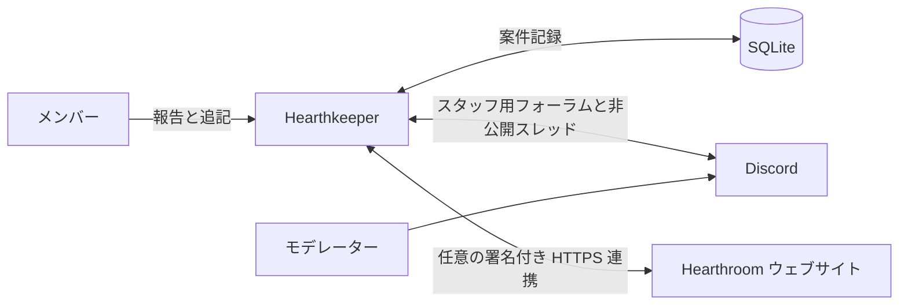

<h1 align="center">Hearthkeeper</h1>

<p align="center">
  コミュニティの問い合わせ対応を支えるオープンソースの Discord Bot。非公開の報告、匿名のフィードバック、案件の共同管理に対応。<br>
  Hearthroom 向けに開発。Node.js と SQLite でセルフホストできます。
</p>

<p align="center">
  <a href="https://hearthroom.club"></a>
  <a href="https://discord.gg/C7m85YPHmK"></a>
  <a href="https://github.com/hearthroom/hearthkeeper/actions/workflows/ci.yml"></a>
  <a href="LICENSE"></a>
  <a href="https://github.com/hearthroom/hearthkeeper/commits/main"></a>
  <a href="https://github.com/hearthroom/hearthkeeper/stargazers"></a>
</p>

<p align="center">
  <a href="README.md">English</a> ·
  <a href="README.zh-Hant.md">繁體中文</a> ·
  <a href="README.zh-Hans.md">简体中文</a> ·
  <b>日本語</b> ·
  <a href="README.ko.md">한국어</a>
</p>

## 概要

Hearthkeeper は、メンバーが相談し、モデレーターが解決まで対応を追跡するための Bot です。メンバーは Discord 内で報告を送り、進捗を確認し、情報を追加できます。モデレーターは非公開フォーラムで案件を担当し、返信、内部メモ、対応結果を残せます。

1 つの Node.js プロセスで 1 つの Discord サーバーに対応します。案件は SQLite に保存し、Discord Gateway で接続します。案件管理は単独で利用でき、[Hearthroom のウェブサイト](https://github.com/hearthroom/hearthroom)と接続すると、アカウント連携、コミュニティ報酬、通知、ウェブからの案件操作も利用できます。

AI サービス、GPU、外部公開の受信ポートは不要です。モデレーションの判断は人が行います。

## 機能

- **報告とフィードバック** — 不具合、クレジットのチャージ、アカウント、キャラクターカードの誤り、審査への質問、カードの通報に対応。
- **非公開の会話** — アカウントを表示する新規報告には、投稿者とモデレーターが会話や添付ファイルの共有を行うプライベートスレッドを作成できます。
- **匿名中継** — 担当画面に Discord アカウントを表示せず、報告や追記ができます。
- **案件管理** — 担当の割り当て、追加情報の依頼、返信、内部メモ、結果の記録、終了、再開。フォーラムのタグに進捗を反映し、スレッドのアーカイブと案件の終了を別々に管理します。
- **永続化された配信** — SQLite に保留中の処理と配信記録を保存し、再起動後も同期を再開できます。
- **任意のウェブ連携** — アカウント連携、チャット経験値とレベル、表示用ロール、公開の非成人向けカードのプレビュー、希望者への通知、ウェブからの案件操作、確認済みサーバーブースト・アバター・デコレーションの同期。
- **運用支援** — ローカルホスト限定のヘルスチェック、Prometheus メトリクス、systemd サービステンプレート。

組み込みの報告カテゴリは Hearthroom 向けです。変更するには `src/cases/catalog.ts` のコードとフォーラム設定の両方を更新する必要があります。

README は 5 言語に対応しています。Bot の画面は現在、英語と繁体字中国語を使用します。一部の案件操作と必須フォーラムタグは繁体字中国語のみです。

## 使い方

[Hearthroom の Discord コミュニティ](https://discord.gg/C7m85YPHmK)に参加するか、サーバー管理者に[セルフホスト](#セルフホスト)を依頼してください。

1. `/hearthkeeper` を開き、カテゴリと非公開／匿名モードを選んでフォームに入力します。`/feedback` から直接報告することもできます。
2. `/myreports` で返信の確認、情報の追加、終了や再開の申請ができます。DM の受信許可は必要ありません。
3. アカウントを表示する報告では、非公開会話の機能が設定され、スレッドの準備ができるとリンクが表示されます。匿名案件は中継方式を維持します。
4. 許可されたモデレーターは `/cases` またはスタッフ用フォーラムのパネルから担当、返信、結果の記録を行います。フォーラムの通常の会話はメンバーへ中継されません。伝える内容は案件の返信操作から送信してください。

| コマンド | 用途 | 利用条件 |
|---|---|---|
| `/hearthkeeper` | コミュニティメニューを開く | 常時 |
| `/ping` | Bot の応答を確認する | 常時 |
| `/feedback` | 非公開または匿名の報告を送る | 案件機能が有効 |
| `/myreports` | 自分の報告を確認・追記する | 案件機能が有効 |
| `/cases` | 案件キューを管理する | 案件機能が有効、許可されたモデレーターのみ |
| `/link` | アカウントの連携状態を確認し、ウェブサイトを開く | ウェブ連携が有効 |
| `/level` | 自分の経験値とレベルを確認する | ウェブ連携が有効 |
| `/xp enabled:false` / `/xp enabled:true` | 今後のチャット経験値の加算を停止・再開する | ウェブ連携が有効 |
| `/subscriptions` | ウェブの通知設定を開く | ウェブ連携が有効 |
| `/card number:<number>` | 公開の非成人向けカードをプレビューする | ウェブ連携が有効 |

コマンドへの応答は実行した本人だけに表示されます。案件の投稿やプライベートスレッドには、それぞれのアクセス権限が適用されます。

## プライバシーと対応範囲

**非公開と匿名は異なります。** プライベートスレッドでは、報告者の Discord アカウントがモデレーターに表示されます。匿名中継では担当画面にアカウントを表示しませんが、Bot は暗号化した本人との対応情報を保持します。運用者、Discord 管理者、本人が書いた内容からの推測に対する匿名性は保証しません。

スタッフ用フォーラムは承認されたモデレーター専用で、報告者を追加することはありません。Discord 管理者やスレッド管理権限を持つ人は、プライベートスレッドにもアクセスできます。

案件は終了から 90 日後に削除処理の対象となります。Discord 側の削除は別途再試行されます。バックアップやダウンロード済み添付ファイルの保存期間は、個別に管理する必要があります。Bot は Message Content 特権インテントを要求せず、メッセージイベントを利用します。フォームの内容や正式な返信は案件データとして保存します。

自動処罰や、通報・異議申し立て専用の担当チームは未実装です。ウェブ連携によって Discord モデレーターにサイトの審査権限が与えられることはありません。

## アーキテクチャ



```text
src/main.ts       Gateway 接続とバックグラウンド同期
src/runtime.ts    コマンド、ヘルス状態、Prometheus メトリクス
src/config.ts     環境変数の検証と機能設定
src/cases/        案件保存、権限、インタラクション、Discord 配信
src/community/    任意のウェブ連携、経験値、ロール、通知
test/             自動テスト
deploy/           systemd サービステンプレート
docs/             要件、設計、運用ガイド
```

案件とコミュニティ配信は別々の SQLite データベースを使います。ウェブ連携は Bot からの HTTPS リクエストで動作し、ヘルスチェックとメトリクスは `127.0.0.1` のみにバインドします。設定対象のサーバーごとに Bot の制御プロセスを 1 つ実行し、再起動時もデータベースと鍵を保持してください。

## 開発

**Node.js 24 LTS** と npm を使用します。テストとビルドに Discord トークンやウェブアカウントは不要です。

```bash
git clone https://github.com/hearthroom/hearthkeeper.git
cd hearthkeeper
npm ci
npm run check
```

| コマンド | 説明 |
|---|---|
| `npm test` | 全自動テストを実行 |
| `npm run typecheck` | ファイルを出力せず TypeScript の型を検査 |
| `npm run build` | TypeScript を `dist/` にコンパイル |
| `npm run check` | テスト、型検査、ビルドを順番に実行 |
| `npm run register` | 指定 Discord サーバーの、このアプリのコマンドを置換。ビルドと認証情報が必要 |
| `npm start` | ビルド済み Bot を起動。認証情報が必要 |

### 継続的インテグレーション

[CI ワークフロー](.github/workflows/ci.yml)は push と Pull Request で、Node.js 24 上の `npm ci` と `npm run check` を実行します。Discord やウェブの認証情報は不要で、Bot のデプロイは行いません。失敗は GitHub Actions の実行結果とログで確認できます。

## セルフホスト

まず[開発](#開発)のクローン、インストール、ビルドを完了してください。[Discord Developer Portal](https://discord.com/developers/applications) でアプリを作成します。**Bot** ページでトークン、**General Information** で Application ID を取得できます。Discord クライアントの開発者モードを有効にし、サーバーを右クリックして ID をコピーし、`DISCORD_GUILD_ID` に設定します。

専用の Discord アプリと、Node.js プロセスを常時実行できるホストを用意します。Guild Install を有効にし、`bot` と `applications.commands` scopes を使用します。Bot は Guilds と GuildMessages intents を使用し、特権 intents や Administrator 権限は不要です。

### 1. 環境を設定する

ビルド後、[環境変数のサンプル](.env.example)をコピーします。

```bash
cp .env.example .env
chmod 600 .env
```

ローカルで `.env` を編集し、`DISCORD_TOKEN`、`DISCORD_APPLICATION_ID`、`DISCORD_GUILD_ID` を設定します。実際の認証情報や案件データはコミットしないでください。

| 設定 | 有効になる機能 |
|---|---|
| 3 つの `DISCORD_*` 値 | Gateway 接続、`/hearthkeeper`、`/ping` |
| `METRICS_PORT` | 任意のローカル監視ポート。既定値は `11940` |
| `CASE_FORUM_ID`、`CASE_STAFF_ROLE_IDS`、`CASE_DATABASE_PATH`、`CASE_IDENTITY_KEY`、`CASE_LOOKUP_KEY` | 報告と案件管理。5 項目すべてが必要 |
| `CASE_PRIVATE_PARENT_ID` | アカウントを表示する新規報告のプライベートスレッド。スタッフ用フォーラムではなく、専用の通常テキストチャンネルを指定 |
| `CASE_PRIVATE_MAX_ACTIVE` | プライベートスレッドの容量保護値。既定値は `100` |
| `COMMUNITY_ENABLED=true` と関連する `COMMUNITY_*` 設定 | 任意の Hearthroom ウェブ連携。既定では無効 |

案件データベースには絶対パスを指定し、親ディレクトリを事前に作成して書き込み可能にしてください。2 つの案件用鍵は異なる値にし、それぞれ 32 バイトの乱数を 64 桁の 16 進数に変換します。保護されたバックアップとともに保管してください。

以下のコマンドで案件用鍵をローカルに生成します。2 回実行し、異なる値をそれぞれの設定に入力してください。出力は共有しないでください。

```bash
node -e "console.log(require('node:crypto').randomBytes(32).toString('hex'))"
```

<details>
<summary>案件フォーラムの必須設定</summary>

1. 指定サーバーに専用フォーラムを作成します。`@everyone` の `ViewChannel` を拒否し、設定したスタッフロールと Bot だけにアクセスを許可します。
2. フォーラムで Bot に `ViewChannel`、`SendMessages`、`EmbedLinks`、`ReadMessageHistory`、`ManageThreads`、`SendMessagesInThreads` を付与します。スタッフロールをメンション可能にするか、Bot にこのフォーラムの `MentionEveryone` を付与して通知を可能にします。
3. 6 つのカテゴリタグを原文のまま作成します：功能異常、儲值問題、帳號問題、角色卡錯誤、審核疑問、角色卡檢舉。さらに「待補充」と「已結案」を作成します。
4. 以下の 7 つの状態タグを作成します。同じサーバーに指定名のカスタム絵文字をアップロードし、Bot の利用を許可して対応するタグに割り当てます。大文字・小文字を含め名前を一致させ、設定値は翻訳しないでください。

| 状態タグ | カスタム絵文字名 |
|---|---|
| 等待中 | `Waiting` |
| 處理中 | `Processing` |
| 等待中（技術） | `Waiting_engineer` |
| 暫停處理 | `In_Progress` |
| 討論中 | `under_discussion` |
| PASS | `Passed` |
| 未採納 | `Not_adopted` |

</details>

案件を有効にする前に、[デプロイガイド](docs/deployment.md#04-問題回饋狀態)（繁体字中国語）に従い、スタッフ用フォーラム、ロール権限、正確なタグとカスタム絵文字を設定します。**0.4 の状態ラベル**と **0.5 の非公開会話**の節を使用してください。それより前のタグの説明は旧版向けです。プライベートスレッドには[専用親チャンネルの権限設定](docs/technical-design/Private_Reports_0.5.md)も必要です。

ウェブ連携には両側の設定、独立した連携用鍵、別のデータベースが必要です。報酬ロールは権限を持たない表示専用とし、Bot のロールより下に配置します。[連携運用ガイド](docs/operations/community-integration.md)（英語）の 0.7 支援者の外観同期に関する前提条件も確認してください。

### 2. コマンドを登録して起動する

Discord のアプリインストール設定から、指定サーバーへ Bot を招待します。登録で置換されるのは、**そのサーバー内の、このアプリのコマンドだけ**です。コマンドが増える機能を有効にしたら再登録してください。

アプリは `.env` を自動で読み込みません。ローカルでは明示的に読み込みます。

```bash
node --env-file=.env dist/src/register.js
node --env-file=.env dist/src/main.js
```

常駐サービスには [systemd テンプレート](deploy/hearthkeeper.service)と[デプロイガイド](docs/deployment.md)を使用します。環境変数が注入済みなら、`npm run register` と `npm start` で同じエントリーポイントを実行できます。通常の起動ではコマンド登録やチャンネル作成を行いません。

### 3. 動作を確認する

Bot を起動したまま、同じホストの別のターミナルで実行します。

```bash
curl -fsS http://127.0.0.1:11940/readyz
curl -fsS http://127.0.0.1:11940/metrics
```

`/healthz` はプロセスを確認します。`/readyz` は Gateway と指定サーバーの準備ができた場合のみ 200 を返します。案件機能では `hearthkeeper_case_forum_ready`、プライベートスレッドでは `hearthkeeper_case_private_ready` も確認し、それぞれが正しく設定されていれば `1` になります。

`/ping` の後、テスト用メンバーとモデレーターで報告・返信を確認してください。別の一般メンバーが他人の案件にアクセスできないことも確認します。監視ポートはローカル限定のままにしてください。サービスの準備完了だけでは、案件の権限やウェブ連携の検証にはなりません。

## ドキュメント

設計・デプロイ文書の多くは繁体字中国語、連携運用ガイドは英語です。

- [要件とプロジェクトの範囲](docs/requirements.md)
- [アーキテクチャと初期設計](docs/technical-design/Hearthkeeper_TechnicalDesign_20260920_V1.0.md)
- [問題とフィードバックのワークフロー](docs/technical-design/Case_Workflows_0.4.md)
- [非公開の会話と権限](docs/technical-design/Private_Reports_0.5.md)
- [デプロイ、バックアップ、監視](docs/deployment.md)
- [ウェブ連携と支援者の外観](docs/operations/community-integration.md)

設計文書には計画中の内容も含まれます。上の機能一覧は現在のソースの機能を説明しており、実際に利用できる機能は運用者の設定によります。

## コミュニティ

相談や開発の連絡には [Discord](https://discord.gg/C7m85YPHmK)をご利用ください。再現可能な不具合や機能提案は [GitHub Issues](https://github.com/hearthroom/hearthkeeper/issues)へ。この Bot が支援するコミュニティは [Hearthroom](https://hearthroom.club)でご覧いただけます。

## 貢献

- **不具合・提案** — 対象コマンド、期待する動作、再現手順を記載してください。架空の案件を使い、個人情報を除いてください。
- **コード** — Pull Request は 1 つの変更に絞り、動作変更にはテストを追加して `npm run check` を実行してください。Discord の権限確認にはテストサーバーを使います。
- **文書・翻訳** — 5 言語の README の内容を揃えてください。README の翻訳と Bot 画面の多言語化は別の作業です。
- **セキュリティ** — [SECURITY.md](SECURITY.md)に従い、**contact@hearthroom.club** へ非公開でご連絡ください。

貢献方法とコミット時の名義については [CONTRIBUTING.md](CONTRIBUTING.md)（繁体字中国語）をご覧ください。外部の貢献者は自身の公開名義や仮名を使用できます。

## ライセンス

[GNU Affero General Public License v3.0](LICENSE)。貢献にも同じライセンスを適用します。デプロイ用の認証情報、メンバーの識別情報、実際の案件データは公開プロジェクトに含まれません。
