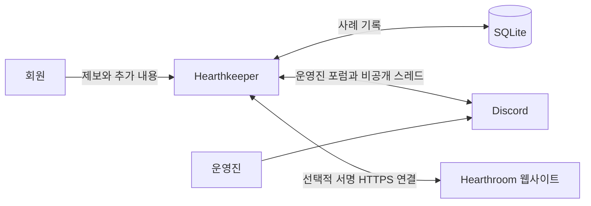

<h1 align="center">Hearthkeeper</h1>

<p align="center">
  커뮤니티 지원을 위한 오픈 소스 Discord 봇. 비공개 제보, 익명 피드백, 공동 사례 처리를 제공합니다.<br>
  Hearthroom을 위해 개발했으며, Node.js와 SQLite로 직접 호스팅할 수 있습니다.
</p>

<p align="center">
  <a href="https://hearthroom.club"></a>
  <a href="https://discord.gg/C7m85YPHmK"></a>
  <a href="https://github.com/hearthroom/hearthkeeper/actions/workflows/ci.yml"></a>
  <a href="LICENSE"></a>
  <a href="https://github.com/hearthroom/hearthkeeper/commits/main"></a>
  <a href="https://github.com/hearthroom/hearthkeeper/stargazers"></a>
</p>

<p align="center">
  <a href="README.md">English</a> ·
  <a href="README.zh-Hant.md">繁體中文</a> ·
  <a href="README.zh-Hans.md">简体中文</a> ·
  <a href="README.ja.md">日本語</a> ·
  <b>한국어</b>
</p>

## 소개

Hearthkeeper는 회원이 도움을 요청하고 운영진이 해결까지 진행 상황을 추적할 수 있도록 돕습니다. 회원은 Discord에서 제보를 제출하고 진행 상황을 확인하며 내용을 추가합니다. 운영진은 비공개 포럼에서 담당자를 정하고 답변, 내부 메모, 처리 결과를 남깁니다.

Node.js 프로세스 하나가 Discord 서버 하나를 담당합니다. 사례는 SQLite에 저장하고 Discord Gateway로 연결합니다. 사례 관리 기능은 독립적으로 사용할 수 있습니다. [Hearthroom 웹사이트](https://github.com/hearthroom/hearthroom)를 연결하면 계정 연동, 커뮤니티 보상, 알림, 웹사이트를 통한 사례 관리도 제공할 수 있습니다.

AI 서비스, GPU, 외부에 공개된 인바운드 포트는 필요하지 않습니다. 관리에 관한 결정은 사람이 내립니다.

## 기능

- **문제 제보와 피드백** — 기능 오류, 크레딧 충전, 계정, 캐릭터 카드 오류, 심사 문의, 카드 신고를 지원합니다.
- **비공개 대화** — 계정을 표시하는 새 제보에 비공개 스레드를 만들어 제보자와 운영진이 대화하고 첨부 파일을 공유할 수 있습니다.
- **익명 전달** — 담당 화면에 Discord 계정을 표시하지 않고 제보하거나 내용을 보충할 수 있습니다.
- **사례 추적** — 담당 지정, 추가 정보 요청, 답변, 내부 메모, 결과 기록, 종결, 재개를 지원합니다. 포럼 태그로 진행 상황을 표시하며, 스레드 보관과 사례 종결은 별도로 관리합니다.
- **영구 저장되는 전달 작업** — SQLite에 대기 작업과 전달 기록을 저장해 재시작 후에도 동기화를 이어갑니다.
- **선택적 웹사이트 연동** — 계정 연동, 채팅 경험치와 레벨, 표시용 역할, 공개 비성인 카드 미리보기, 신청자 대상 알림, 웹사이트 사례 처리, 확인된 서버 부스트·아바타·장식 동기화를 제공합니다.
- **운영 도구** — 로컬호스트 전용 상태 확인, Prometheus 지표, systemd 서비스 템플릿을 제공합니다.

기본 제보 분류는 Hearthroom에 맞춰져 있습니다. 분류를 바꾸려면 `src/cases/catalog.ts` 코드와 포럼 설정을 함께 수정해야 합니다.

README는 5개 언어로 제공됩니다. 봇 인터페이스는 현재 영어와 번체 중국어를 사용합니다. 일부 사례 작업과 필수 포럼 태그는 번체 중국어로만 제공됩니다.

## 사용 방법

[Hearthroom Discord 커뮤니티](https://discord.gg/C7m85YPHmK)에 참여하거나 서버 관리자에게 [직접 호스팅](#직접-호스팅)을 요청하세요.

1. `/hearthkeeper`를 열어 분류와 비공개·익명 모드를 선택하고 양식을 작성합니다. `/feedback`으로 바로 제보할 수도 있습니다.
2. `/myreports`에서 답변을 읽고 내용을 추가하거나 종결·재개를 요청합니다. DM 수신을 허용하지 않아도 사례를 추적할 수 있습니다.
3. 계정을 표시하는 제보는 비공개 대화 기능이 설정되고 스레드가 준비되면 입장 링크가 표시됩니다. 익명 사례는 전달 방식으로 유지됩니다.
4. 권한이 있는 운영진은 `/cases` 또는 운영진 포럼 패널에서 담당 지정, 답변, 결과 기록을 진행합니다. 포럼의 일반 대화는 회원에게 전달되지 않습니다. 회원에게 보낼 내용은 사례 답변 기능을 사용하세요.

| 명령어 | 용도 | 사용 조건 |
|---|---|---|
| `/hearthkeeper` | 커뮤니티 메뉴 열기 | 기본 기능 |
| `/ping` | 봇 응답 확인 | 기본 기능 |
| `/feedback` | 비공개 또는 익명 제보 제출 | 사례 기능 활성화 |
| `/myreports` | 본인 제보 확인 및 내용 추가 | 사례 기능 활성화 |
| `/cases` | 사례 대기열 관리 | 사례 기능 활성화, 승인된 운영진 전용 |
| `/link` | 계정 연동 상태 확인 및 웹사이트 열기 | 웹사이트 연동 활성화 |
| `/level` | 본인의 경험치와 레벨 확인 | 웹사이트 연동 활성화 |
| `/xp enabled:false` / `/xp enabled:true` | 이후 채팅 경험치 적립 중지·재개 | 웹사이트 연동 활성화 |
| `/subscriptions` | 웹사이트 알림 설정 열기 | 웹사이트 연동 활성화 |
| `/card number:<number>` | 공개 비성인 카드 미리보기 | 웹사이트 연동 활성화 |

명령어 응답은 실행한 본인에게만 표시됩니다. 사례 게시물과 비공개 스레드에는 각각의 접근 권한이 적용됩니다.

## 개인정보와 지원 범위

**비공개와 익명은 다릅니다.** 비공개 스레드에서는 운영진에게 제보자의 Discord 계정이 표시됩니다. 익명 전달은 담당 화면에서 계정을 숨기지만, 봇은 암호화된 신원 매핑을 보관합니다. 서비스 운영자, Discord 관리자, 제보자가 직접 작성한 내용에 따른 추론에 대해서는 익명성을 보장하지 않습니다.

운영진 포럼은 승인된 운영진 전용이며 제보자를 추가하지 않습니다. Discord 관리자와 스레드 관리 권한을 가진 사람은 비공개 스레드에도 접근할 수 있습니다.

사례는 종결 90일 후 정리 대상이 됩니다. Discord 측 삭제는 별도로 재시도하며, 백업과 다운로드한 첨부 파일의 보관 기간은 따로 관리해야 합니다. 봇은 Message Content 특권 인텐트를 요청하지 않고 메시지 이벤트를 사용합니다. 양식 제출 내용과 공식 사례 답변은 사례 데이터로 저장합니다.

자동 제재와 신고·이의 신청을 위한 별도 담당 그룹은 아직 구현되지 않았습니다. 웹사이트 연동으로 Discord 운영진에게 사이트 심사 권한이 부여되지는 않습니다.

## 구조



```text
src/main.ts       Gateway 연결 및 백그라운드 동기화
src/runtime.ts    명령어, 상태 정보, Prometheus 지표
src/config.ts     환경 변수 검증 및 기능 설정
src/cases/        사례 저장, 권한, 상호작용, Discord 전달
src/community/    선택적 웹사이트 연결, 경험치, 역할, 알림
test/             자동화 테스트
deploy/           systemd 서비스 템플릿
docs/             요구 사항, 설계, 운영 가이드
```

사례와 커뮤니티 전달 기능은 서로 다른 SQLite 데이터베이스를 사용합니다. 웹사이트 연결은 봇이 보내는 HTTPS 요청으로 작동하며, 상태 확인과 지표는 `127.0.0.1`에만 바인딩합니다. 설정한 서버마다 봇 제어 프로세스를 하나만 실행하고, 재시작할 때 데이터베이스와 키를 유지하세요.

## 개발

**Node.js 24 LTS**와 npm을 사용합니다. 테스트와 빌드에는 Discord 토큰이나 웹사이트 계정이 필요하지 않습니다.

```bash
git clone https://github.com/hearthroom/hearthkeeper.git
cd hearthkeeper
npm ci
npm run check
```

| 명령어 | 설명 |
|---|---|
| `npm test` | 전체 자동화 테스트 실행 |
| `npm run typecheck` | 파일 생성 없이 TypeScript 타입 검사 |
| `npm run build` | TypeScript를 `dist/`로 컴파일 |
| `npm run check` | 테스트, 타입 검사, 빌드를 순서대로 실행 |
| `npm run register` | 지정 Discord 서버에서 이 앱의 명령어를 교체. 빌드와 인증 정보 필요 |
| `npm start` | 빌드된 봇 시작. 인증 정보 필요 |

### 지속적 통합

[CI 워크플로](.github/workflows/ci.yml)는 push와 Pull Request에서 Node.js 24로 `npm ci`와 `npm run check`를 실행합니다. Discord나 웹사이트 인증 정보가 필요 없으며 봇을 배포하지 않습니다. 실패 내용은 GitHub Actions 실행 결과와 로그에서 확인할 수 있습니다.

## 직접 호스팅

먼저 [개발](#개발)의 복제, 설치, 빌드 단계를 완료하세요. [Discord Developer Portal](https://discord.com/developers/applications)에서 앱을 만듭니다. **Bot** 페이지에서 토큰을, **General Information**에서 Application ID를 얻습니다. Discord 클라이언트에서 개발자 모드를 켠 뒤 서버를 우클릭해 ID를 복사하고 `DISCORD_GUILD_ID`에 입력하세요.

전용 Discord 앱과 Node.js 프로세스를 계속 실행할 수 있는 호스트를 준비합니다. Guild Install을 활성화하고 `bot`, `applications.commands` scopes를 사용합니다. 봇은 Guilds와 GuildMessages intents를 사용하며, 특권 intents나 Administrator 권한은 필요하지 않습니다.

### 1. 환경 설정

빌드 후 [환경 변수 예시](.env.example)를 복사합니다.

```bash
cp .env.example .env
chmod 600 .env
```

로컬에서 `.env`를 편집해 `DISCORD_TOKEN`, `DISCORD_APPLICATION_ID`, `DISCORD_GUILD_ID`를 설정합니다. 실제 인증 정보나 사례 데이터는 커밋하지 마세요.

| 설정 | 활성화되는 기능 |
|---|---|
| 세 가지 `DISCORD_*` 값 | Gateway 연결, `/hearthkeeper`, `/ping` |
| `METRICS_PORT` | 선택적 로컬 모니터링 포트. 기본값 `11940` |
| `CASE_FORUM_ID`, `CASE_STAFF_ROLE_IDS`, `CASE_DATABASE_PATH`, `CASE_IDENTITY_KEY`, `CASE_LOOKUP_KEY` | 제보 및 사례 추적. 다섯 가지를 함께 설정해야 함 |
| `CASE_PRIVATE_PARENT_ID` | 계정을 표시하는 새 제보의 비공개 스레드. 운영진 포럼이 아닌 전용 일반 텍스트 채널 사용 |
| `CASE_PRIVATE_MAX_ACTIVE` | 비공개 스레드 용량 보호값. 기본값 `100` |
| `COMMUNITY_ENABLED=true` 및 관련 `COMMUNITY_*` 설정 | 선택적 Hearthroom 웹사이트 연동. 기본적으로 비활성화 |

사례 데이터베이스는 절대 경로여야 하며 상위 디렉터리가 존재하고 쓰기 가능해야 합니다. 두 사례 키는 서로 달라야 하고, 각각 32바이트 난수를 64자리 16진수로 인코딩한 값이어야 합니다. 보호된 백업과 함께 보관하세요.

아래 명령어로 사례 키를 로컬에서 생성하세요. 두 번 실행해 서로 다른 값을 각각의 설정에 입력하세요. 출력 내용을 공유하지 마세요.

```bash
node -e "console.log(require('node:crypto').randomBytes(32).toString('hex'))"
```

<details>
<summary>사례 포럼 필수 설정</summary>

1. 지정 서버에 전용 포럼을 만듭니다. `@everyone`의 `ViewChannel`을 거부하고 설정한 운영진 역할과 봇에만 접근을 허용합니다.
2. 포럼에서 봇에 `ViewChannel`, `SendMessages`, `EmbedLinks`, `ReadMessageHistory`, `ManageThreads`, `SendMessagesInThreads`를 부여합니다. 운영진 역할을 멘션 가능하게 하거나 봇에 이 포럼의 `MentionEveryone` 권한을 부여해 해당 역할에 알릴 수 있게 합니다.
3. 여섯 분류 태그를 원문 그대로 만듭니다: 功能異常, 儲值問題, 帳號問題, 角色卡錯誤, 審核疑問, 角色卡檢舉. 「待補充」와 「已結案」도 만듭니다.
4. 아래 일곱 상태 태그를 만듭니다. 같은 서버에 지정된 이름의 사용자 지정 이모지를 업로드하고 봇의 사용을 허용한 뒤 해당 태그에 연결합니다. 대소문자까지 일치해야 하며 설정값을 번역하면 안 됩니다.

| 상태 태그 | 사용자 지정 이모지 이름 |
|---|---|
| 等待中 | `Waiting` |
| 處理中 | `Processing` |
| 等待中（技術） | `Waiting_engineer` |
| 暫停處理 | `In_Progress` |
| 討論中 | `under_discussion` |
| PASS | `Passed` |
| 未採納 | `Not_adopted` |

</details>

사례 기능을 활성화하기 전에 [배포 가이드](docs/deployment.md#04-問題回饋狀態)(번체 중국어)에 따라 운영진 포럼, 역할 권한, 정확한 태그와 사용자 지정 이모지를 설정하세요. **0.4 상태 라벨**과 **0.5 비공개 대화**절을 따르세요. 그보다 앞의 태그 설명은 이전 버전용입니다. 비공개 스레드는 [전용 상위 채널 권한](docs/technical-design/Private_Reports_0.5.md)도 필요합니다.

웹사이트 연동에는 양쪽 설정, 독립적인 연결 키, 별도 데이터베이스가 필요합니다. 보상 역할은 권한이 없는 표시 전용이어야 하며 봇 역할보다 아래에 있어야 합니다. [연동 운영 가이드](docs/operations/community-integration.md)(영어)에서 0.7 후원자 외형 기능의 사전 요구 사항도 확인하세요.

### 2. 명령어 등록 및 시작

Discord 앱 설치 설정을 통해 지정 서버에 봇을 초대합니다. 등록은 **해당 서버에서 이 앱의 명령어만** 교체합니다. 명령어가 추가되는 기능을 활성화했다면 다시 등록하세요.

앱은 `.env`를 자동으로 읽지 않습니다. 로컬 실행 시 명시적으로 불러옵니다.

```bash
node --env-file=.env dist/src/register.js
node --env-file=.env dist/src/main.js
```

상시 서비스에는 [systemd 템플릿](deploy/hearthkeeper.service)과 [배포 가이드](docs/deployment.md)를 사용하세요. 환경 변수가 이미 주입되어 있다면 `npm run register`와 `npm start`로 같은 진입점을 실행할 수 있습니다. 일반 시작은 명령어를 등록하거나 채널을 만들지 않습니다.

### 3. 인스턴스 확인

봇을 실행한 상태로 같은 호스트의 다른 터미널에서 실행합니다.

```bash
curl -fsS http://127.0.0.1:11940/readyz
curl -fsS http://127.0.0.1:11940/metrics
```

`/healthz`는 프로세스를 확인합니다. `/readyz`는 Gateway와 지정 서버가 준비되었을 때만 200을 반환합니다. 사례 기능은 `hearthkeeper_case_forum_ready`, 비공개 스레드는 `hearthkeeper_case_private_ready`도 확인하세요. 각 기능이 올바르게 설정되었다면 값은 `1`입니다.

`/ping`을 실행한 뒤 테스트 회원과 운영진으로 제보와 답변을 확인하세요. 다른 일반 회원이 첫 번째 회원의 사례에 접근할 수 없어야 합니다. 모니터링 포트는 로컬 전용으로 유지하세요. 서비스 준비 완료만으로 사례 권한이나 웹사이트 연동이 검증되지는 않습니다.

## 문서

대부분의 설계·배포 문서는 번체 중국어이며 연동 운영 가이드는 영어입니다.

- [요구 사항과 프로젝트 범위](docs/requirements.md)
- [구조와 초기 설계](docs/technical-design/Hearthkeeper_TechnicalDesign_20260920_V1.0.md)
- [문제 및 피드백 처리 흐름](docs/technical-design/Case_Workflows_0.4.md)
- [비공개 대화와 권한](docs/technical-design/Private_Reports_0.5.md)
- [배포, 백업, 모니터링](docs/deployment.md)
- [웹사이트 연동과 후원자 외형](docs/operations/community-integration.md)

설계 문서에는 계획 중인 작업도 포함됩니다. 위 기능 목록은 현재 소스의 기능을 설명하며, 실제 활성화되는 기능은 각 운영자의 설정에 따라 달라집니다.

## 커뮤니티

논의와 개발 협업은 [Discord](https://discord.gg/C7m85YPHmK)를 이용하세요. 재현 가능한 버그와 기능 제안은 [GitHub Issues](https://github.com/hearthroom/hearthkeeper/issues)에 등록해 주세요. 이 봇이 지원하는 커뮤니티는 [Hearthroom](https://hearthroom.club)에서 살펴볼 수 있습니다.

## 기여

- **버그와 제안** — 관련 명령어, 기대 동작, 재현 절차를 설명해 주세요. 가상의 사례를 사용하고 개인 정보를 제거하세요.
- **코드** — Pull Request는 한 가지 변경에 집중하고, 동작 변경에는 테스트를 추가한 뒤 `npm run check`를 실행하세요. Discord 권한 검증은 테스트 서버에서 진행하세요.
- **문서와 번역** — 5개 README의 내용을 맞춰 주세요. README 번역과 봇 인터페이스 현지화는 별도의 작업입니다.
- **보안** — [SECURITY.md](SECURITY.md)에 따라 **contact@hearthroom.club**으로 비공개 제보해 주세요.

기여 방법과 커밋 신원 안내는 [CONTRIBUTING.md](CONTRIBUTING.md)(번체 중국어)를 참고하세요. 외부 기여자는 자신의 공개 신원이나 가명을 사용할 수 있습니다.

## 라이선스

[GNU Affero General Public License v3.0](LICENSE). 기여에도 같은 라이선스가 적용됩니다. 배포 인증 정보, 회원 신원, 실제 사례 데이터는 이 공개 프로젝트에 포함되지 않습니다.
