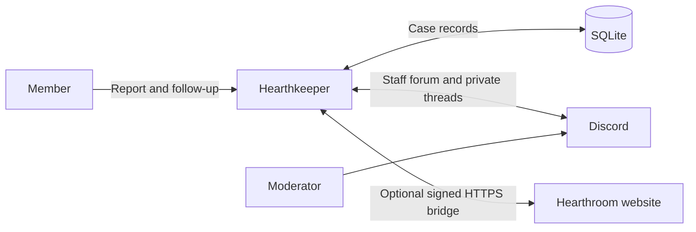

<h1 align="center">Hearthkeeper</h1>

<p align="center">
  An open-source Discord bot for community support: private reports, anonymous feedback, and a shared case queue.<br>
  Built for Hearthroom. Self-hosted with Node.js and SQLite.
</p>

<p align="center">
  <a href="https://hearthroom.club"></a>
  <a href="https://discord.gg/C7m85YPHmK"></a>
  <a href="https://github.com/hearthroom/hearthkeeper/actions/workflows/ci.yml"></a>
  <a href="LICENSE"></a>
  <a href="https://github.com/hearthroom/hearthkeeper/commits/main"></a>
  <a href="https://github.com/hearthroom/hearthkeeper/stargazers"></a>
</p>

<p align="center">
  <b>English</b> ·
  <a href="README.zh-Hant.md">繁體中文</a> ·
  <a href="README.zh-Hans.md">简体中文</a> ·
  <a href="README.ja.md">日本語</a> ·
  <a href="README.ko.md">한국어</a>
</p>

## Overview

Hearthkeeper gives members a place to ask for help and moderators a way to follow each report through to resolution. Members submit reports inside Discord, check progress, and add information. Moderators work from a private forum, with assignments, replies, internal notes, and a record of each decision.

The bot runs as one Node.js process for one Discord server. It stores cases in SQLite and connects through the Discord Gateway. The case workflow works on its own; connecting a [Hearthroom](https://github.com/hearthroom/hearthroom) website adds account links, community rewards, notifications, and website access to cases.

No AI service, GPU, or public inbound port is required. Moderation decisions stay with people.

## Features

- **Reports and feedback** — categories for bugs, credit top-ups, accounts, card errors, review questions, and card reports.
- **Private conversations** — optionally give each new identified report a private thread where the member and moderators can talk and share attachments.
- **Anonymous relay** — members can submit and follow up without showing their Discord account to the handling moderator.
- **Case tracking** — claim cases, request information, reply, keep internal notes, record outcomes, close, and reopen. Forum tags reflect progress; archiving a thread is separate from closing a case.
- **Persistent delivery** — SQLite records pending work and delivery receipts so synchronization can resume after a restart.
- **Optional website integration** — account linking, chat XP and levels, display roles, public non-adult card previews, opt-in notifications, website cases, and verified server-boost/avatar/decoration synchronization.
- **Operations** — loopback health endpoints, Prometheus metrics, and a systemd service template.

The built-in report categories are tailored to Hearthroom. Changing them requires code changes in `src/cases/catalog.ts` and matching forum configuration.

These READMEs are available in five languages. The bot interface currently uses English and Traditional Chinese; some case controls and required forum tags use Traditional Chinese only.

## Usage

Join the [Hearthroom Discord community](https://discord.gg/C7m85YPHmK), or ask your server administrator to [set up an instance](#self-hosting).

1. Open `/hearthkeeper`, select a category, choose private or anonymous reporting, and fill in the form. `/feedback` is a direct entry to reporting.
2. Use `/myreports` to read replies, add information, or request closure or reopening. Case tracking does not depend on accepting DMs.
3. For identified reports, a private conversation link appears when that feature is configured and the thread is ready. Anonymous cases stay in the relay workflow.
4. Authorized moderators use `/cases` or the staff forum panel to claim a case, reply, and record its outcome. Ordinary staff-forum messages are not relayed to members; use the case reply action.

| Command | Purpose | Availability |
|---|---|---|
| `/hearthkeeper` | Open the community menu | Always |
| `/ping` | Check whether the bot responds | Always |
| `/feedback` | Submit a private or anonymous report | Cases enabled |
| `/myreports` | View and follow up on your own reports | Cases enabled |
| `/cases` | Manage the case queue | Cases enabled; authorized moderators |
| `/link` | Check account linking and open the website | Website integration enabled |
| `/level` | View your community XP and level | Website integration enabled |
| `/xp enabled:false` / `/xp enabled:true` | Pause or resume future chat XP | Website integration enabled |
| `/subscriptions` | Open website notification settings | Website integration enabled |
| `/card number:<number>` | Preview a public, non-adult card | Website integration enabled |

Command responses are ephemeral: only the person invoking the command sees them. Case posts and private threads have their own access rules.

## Privacy and scope

**Private and anonymous are different.** A private thread shows the reporter's Discord account to moderators. Anonymous relay hides that account from the handling interface, but the bot retains an encrypted identity mapping. It does not promise anonymity from operators, Discord administrators, or details a member writes into a report.

The staff forum is restricted to approved moderators. Reporters are never added to it. Discord administrators and people with thread-management permissions can still access private threads.

Cases become eligible for cleanup 90 days after closure. Discord deletion is retried separately; backups and downloaded attachments need their own retention handling. The bot uses message events without requesting the privileged Message Content intent; form submissions and formal case replies are stored as case data.

Automated punishments and separate complaint/appeal handling teams are not implemented. The optional website connection does not turn Discord moderators into website reviewers.

## Architecture



```text
src/main.ts       Gateway connection and background synchronization
src/runtime.ts    Commands, health state, and Prometheus metrics
src/config.ts     Environment validation and feature configuration
src/cases/        Case storage, permissions, interactions, and Discord delivery
src/community/    Optional website bridge, XP, roles, and notifications
test/             Automated tests
deploy/           systemd service template
docs/             Requirements, design notes, and operations guides
```

Cases and community delivery use separate SQLite databases. The website bridge makes outbound HTTPS requests; health and metrics bind only to `127.0.0.1`. Run one bot controller per configured server and preserve its databases and keys across restarts.

## Development

Use **Node.js 24 LTS** and npm. You can test and build without a Discord token or website account.

```bash
git clone https://github.com/hearthroom/hearthkeeper.git
cd hearthkeeper
npm ci
npm run check
```

| Command | Description |
|---|---|
| `npm test` | Run the complete automated test suite |
| `npm run typecheck` | Check TypeScript types without emitting files |
| `npm run build` | Compile TypeScript into `dist/` |
| `npm run check` | Run tests, type checking, and build in sequence |
| `npm run register` | Replace this application's commands in the configured Discord server; requires a build and credentials |
| `npm start` | Start the built bot; requires credentials |

### Continuous integration

The [CI workflow](.github/workflows/ci.yml) runs `npm ci` and `npm run check` on Node.js 24 for pushes and pull requests. It needs no Discord or website credentials and does not deploy the bot. Failures appear in the GitHub Actions run and its logs.

## Self-hosting

First complete the clone, install, and build steps under [Development](#development). Create the application in the [Discord Developer Portal](https://discord.com/developers/applications): the **Bot** page provides the token, and **General Information** provides the application ID. Enable Developer Mode in your Discord client, then right-click your server and copy its ID for `DISCORD_GUILD_ID`.

Start with a dedicated Discord application and a machine that can keep a Node.js process running. Enable Guild Install with the `bot` and `applications.commands` scopes. The bot uses Guilds and GuildMessages intents; privileged intents and Administrator permission are not required.

### 1. Configure the environment

After building, copy the [environment example](.env.example):

```bash
cp .env.example .env
chmod 600 .env
```

Edit `.env` locally. Set `DISCORD_TOKEN`, `DISCORD_APPLICATION_ID`, and `DISCORD_GUILD_ID`. Never commit real credentials or case data.

| Configuration | What it enables |
|---|---|
| Three `DISCORD_*` values | Gateway connection, `/hearthkeeper`, and `/ping` |
| `METRICS_PORT` | Optional loopback port; defaults to `11940` |
| `CASE_FORUM_ID`, `CASE_STAFF_ROLE_IDS`, `CASE_DATABASE_PATH`, `CASE_IDENTITY_KEY`, `CASE_LOOKUP_KEY` | Reporting and case tracking; all five are required together |
| `CASE_PRIVATE_PARENT_ID` | Private threads for new identified reports; use a dedicated normal text channel, not the staff forum |
| `CASE_PRIVATE_MAX_ACTIVE` | Private-thread capacity guard; defaults to `100` |
| `COMMUNITY_ENABLED=true` and the associated `COMMUNITY_*` settings | Optional Hearthroom website integration; disabled by default |

Case database paths must be absolute and their parent directories must exist and be writable. The two case keys must be distinct, each containing 32 random bytes encoded as 64 hexadecimal characters. Preserve them with your protected backups.

Generate each case key locally with the following command. Run it twice and place the two different values in the corresponding settings; do not share the output.

```bash
node -e "console.log(require('node:crypto').randomBytes(32).toString('hex'))"
```

<details>
<summary>Required case-forum setup</summary>

1. Create a dedicated forum in the configured server. Deny `ViewChannel` to `@everyone`; allow access only to the configured staff roles and the bot.
2. Grant the bot `ViewChannel`, `SendMessages`, `EmbedLinks`, `ReadMessageHistory`, `ManageThreads`, and `SendMessagesInThreads` in that forum. Staff roles must be mentionable, or the bot needs `MentionEveryone` in this forum to notify those roles.
3. Create the six category tags exactly as written: 功能異常, 儲值問題, 帳號問題, 角色卡錯誤, 審核疑問, 角色卡檢舉. Also create 待補充 and 已結案.
4. Create the seven status tags below. Upload a custom emoji for each name in the same server, allow the bot to use it, and assign it to its tag. Names and capitalization must match; do not translate these configuration values.

| Status tag | Custom emoji name |
|---|---|
| 等待中 | `Waiting` |
| 處理中 | `Processing` |
| 等待中（技術） | `Waiting_engineer` |
| 暫停處理 | `In_Progress` |
| 討論中 | `under_discussion` |
| PASS | `Passed` |
| 未採納 | `Not_adopted` |

</details>

Before enabling cases, configure the staff forum, role permissions, and exact tags/custom emoji described in the [deployment guide](docs/deployment.md#04-問題回饋狀態) (Traditional Chinese). Follow its **0.4 status labels** and **0.5 private conversations** sections; older label instructions describe previous versions. Private threads also require the [dedicated parent-channel permissions](docs/technical-design/Private_Reports_0.5.md).

Website integration requires configuration on both sides, an independent bridge key, and a separate database. Reward roles are display-only roles with no permissions, below the bot's role. See the [integration operations guide](docs/operations/community-integration.md) (English), including the 0.7 supporter appearance prerequisites.

### 2. Register commands and start

Invite your application to the configured server using Discord's installation settings. Registration replaces **only this application's commands in that server**. Repeat it when enabling features that add commands.

The application does not load `.env` automatically. For a local run, load it explicitly:

```bash
node --env-file=.env dist/src/register.js
node --env-file=.env dist/src/main.js
```

For a managed service, use the [systemd template](deploy/hearthkeeper.service) and the [deployment guide](docs/deployment.md). With the environment already injected, `npm run register` and `npm start` run the same entry points. Normal startup does not register commands or create channels.

### 3. Verify the instance

Keep the bot running and execute these commands in another terminal on the same host:

```bash
curl -fsS http://127.0.0.1:11940/readyz
curl -fsS http://127.0.0.1:11940/metrics
```

`/healthz` checks the process; `/readyz` returns 200 only when the Gateway and configured server are ready. For cases, also check `hearthkeeper_case_forum_ready`; private threads have `hearthkeeper_case_private_ready`. Both should be `1` when their respective features are configured correctly.

Run `/ping`, then verify reporting and replies with test members and a moderator. A second ordinary member must not be able to access the first member's case. Keep metrics on loopback; service readiness alone does not prove case permissions or website integration.

## Documentation

Most design and deployment documents are in Traditional Chinese; the integration operations guide is in English.

- [Requirements and project scope](docs/requirements.md)
- [Architecture and original design](docs/technical-design/Hearthkeeper_TechnicalDesign_20260920_V1.0.md)
- [Problem and feedback workflows](docs/technical-design/Case_Workflows_0.4.md)
- [Private conversations and permissions](docs/technical-design/Private_Reports_0.5.md)
- [Deployment, backups, and monitoring](docs/deployment.md)
- [Website integration and supporter appearance](docs/operations/community-integration.md)

Design documents include planned work. The feature list above describes the current source, while enabled features depend on each operator's configuration.

## Community

Join [Discord](https://discord.gg/C7m85YPHmK) for discussion and development coordination. Use [GitHub issues](https://github.com/hearthroom/hearthkeeper/issues) for reproducible bugs and feature proposals. Visit [Hearthroom](https://hearthroom.club) to explore the community this bot was built for.

## Contributing

- **Bugs and ideas** — describe the affected command, expected behavior, and steps to reproduce. Use fictional cases and remove private data.
- **Code** — keep pull requests focused, add tests for changed behavior, and run `npm run check`. Use a test server for Discord permission checks.
- **Documentation and translations** — keep all five READMEs aligned. README translation does not add a bot UI language; interface localization is separate work.
- **Security** — follow [SECURITY.md](SECURITY.md) and report vulnerabilities privately to **contact@hearthroom.club**.

See [CONTRIBUTING.md](CONTRIBUTING.md) for contribution and commit-identity guidance (Traditional Chinese). External contributors may use their own public identity or a pseudonym.

## License

[GNU Affero General Public License v3.0](LICENSE). Contributions use the same license. Deployment credentials, member identities, and actual case data are not part of this public project.
