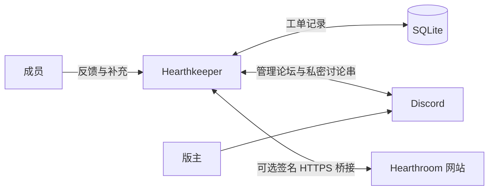

<h1 align="center">Hearthkeeper</h1>

<p align="center">
  开源 Discord 社区支持机器人：私密反馈、匿名建议，以及共同处理的工单队列。<br>
  为 Hearthroom 打造，使用 Node.js 和 SQLite 自行部署。
</p>

<p align="center">
  <a href="https://hearthroom.club"></a>
  <a href="https://discord.gg/C7m85YPHmK"></a>
  <a href="https://github.com/hearthroom/hearthkeeper/actions/workflows/ci.yml"></a>
  <a href="LICENSE"></a>
  <a href="https://github.com/hearthroom/hearthkeeper/commits/main"></a>
  <a href="https://github.com/hearthroom/hearthkeeper/stargazers"></a>
</p>

<p align="center">
  <a href="README.md">English</a> ·
  <a href="README.zh-Hant.md">繁體中文</a> ·
  <b>简体中文</b> ·
  <a href="README.ja.md">日本語</a> ·
  <a href="README.ko.md">한국어</a>
</p>

## 概述

Hearthkeeper 让成员有地方求助，也让版主能持续跟进每一份反馈。成员直接在 Discord 提交问题、查看进度、补充信息；版主则在私密论坛认领工单、回复、留下内部备注与处理结果。

一个 Node.js 进程服务一个 Discord 服务器，使用 SQLite 保存工单，通过 Discord Gateway 连接。工单功能可独立运行；连接 [Hearthroom 网站](https://github.com/hearthroom/hearthroom)后，还能提供账号关联、社区奖励、通知，以及网站端的工单入口。

不需要 AI 服务、GPU 或对外开放的入站端口。管理决定由版主作出。

## 功能

- **问题反馈与建议**：支持功能异常、充值问题、账号问题、角色卡错误、审核疑问及角色卡举报。
- **私密对话**：可为新的非匿名反馈建立私密讨论串，让提交者与版主直接交谈、发送附件。
- **匿名转达**：成员可提交和补充反馈，处理界面不显示其 Discord 账号。
- **工单跟进**：认领、要求补充、回复、内部备注、记录结果、结单与重新开启。论坛标签反映进度；归档讨论串与结单是不同操作。
- **持久化投递**：SQLite 保存待处理任务与投递记录，重启后能继续同步。
- **可选网站集成**：账号关联、发言经验值与等级、展示身份组、公开非成人角色卡预览、自愿订阅的通知、网站工单，以及经过验证的服务器助力／头像／装饰同步。
- **运维工具**：仅限本机的健康检查、Prometheus 指标，以及 systemd 服务模板。

内置反馈分类针对 Hearthroom 的使用场景设计。调整分类需要修改 `src/cases/catalog.ts`，并同步调整论坛配置。

README 提供五种语言。机器人界面目前使用英语与繁体中文；部分工单操作与必需的论坛标签仅使用繁体中文。

## 使用方法

加入 [Hearthroom Discord 社区](https://discord.gg/C7m85YPHmK)，或请服务器管理员[自行部署](#自行部署)。

1. 打开 `/hearthkeeper`，选择分类与私密／匿名模式，填写表单。也可用 `/feedback` 直接进入反馈。
2. 用 `/myreports` 查看回复、补充内容，或申请结单与重新开启；无需开启 Discord 私信即可跟进工单。
3. 非匿名反馈在私密对话功能已配置、讨论串就绪后，会显示入口链接。匿名工单保持转达方式。
4. 授权版主通过 `/cases` 或管理论坛面板认领、回复和记录结果。论坛内的普通聊天不会转达给成员，对外回复请使用工单回复操作。

| 命令 | 用途 | 启用条件 |
|---|---|---|
| `/hearthkeeper` | 打开社区菜单 | 基础功能 |
| `/ping` | 确认机器人是否响应 | 基础功能 |
| `/feedback` | 提交私密或匿名反馈 | 已启用工单功能 |
| `/myreports` | 查看与补充自己的反馈 | 已启用工单功能 |
| `/cases` | 处理工单队列 | 已启用工单功能；仅限授权版主 |
| `/link` | 查看账号关联状态并前往网站 | 已启用网站集成 |
| `/level` | 查看自己的社区经验值与等级 | 已启用网站集成 |
| `/xp enabled:false` / `/xp enabled:true` | 停止或恢复后续发言计分 | 已启用网站集成 |
| `/subscriptions` | 打开网站通知设置 | 已启用网站集成 |
| `/card number:<number>` | 预览公开、非成人角色卡 | 已启用网站集成 |

命令回复仅操作本人可见。工单帖子与私密讨论串则遵循各自的访问权限。

## 隐私与功能范围

**私密与匿名不同。** 私密讨论串会向版主显示提交者的 Discord 账号。匿名转达不在处理界面显示账号，但机器人仍保存加密的身份映射；不保证对运维人员、Discord 服务器管理员或反馈内容本身匿名。

管理论坛仅供获批的版主使用，提交者不会被加入论坛。Discord 服务器管理员及有讨论串管理权限的人仍能访问私密讨论串。

工单在结单 90 天后进入清理范围，Discord 端的删除会单独重试；备份与已下载附件需另行管理保留期限。机器人使用消息事件，不申请 Message Content 特权 intent；表单与正式工单回复则会保存为工单数据。

目前未提供自动处罚，也未建立举报／申诉的独立处理团队。网站集成不会让 Discord 服务器管理员自动获得网站审核权限。

## 架构



```text
src/main.ts       Gateway 连接与后台同步
src/runtime.ts    命令、健康状态与 Prometheus 指标
src/config.ts     环境变量验证与功能配置
src/cases/        工单存储、权限、交互与 Discord 投递
src/community/    可选网站桥接、经验值、身份组与通知
test/             自动化测试
deploy/           systemd 服务模板
docs/             需求、设计与运维文档
```

工单与社区投递使用各自的 SQLite 数据库。网站桥接由机器人向外发出 HTTPS 请求，健康检查与指标只绑定 `127.0.0.1`。每个配置的服务器运行一个机器人控制进程，重启时保留数据库和密钥。

## 开发

使用 **Node.js 24 LTS** 和 npm。运行测试和构建不需要 Discord Token 或网站账号。

```bash
git clone https://github.com/hearthroom/hearthkeeper.git
cd hearthkeeper
npm ci
npm run check
```

| 命令 | 说明 |
|---|---|
| `npm test` | 运行完整自动化测试 |
| `npm run typecheck` | 检查 TypeScript 类型，不生成文件 |
| `npm run build` | 将 TypeScript 编译到 `dist/` |
| `npm run check` | 依次运行测试、类型检查与构建 |
| `npm run register` | 替换此应用在指定 Discord 服务器的命令；需先构建并提供凭据 |
| `npm start` | 启动已构建的机器人；需提供凭据 |

### 持续集成

[CI 工作流](.github/workflows/ci.yml)会在 push 和 Pull Request 时，使用 Node.js 24 运行 `npm ci` 和 `npm run check`。无需 Discord 或网站凭据，也不会部署机器人；失败原因可在 GitHub Actions 运行记录与日志中查看。

## 自行部署

先完成[开发](#开发)章节的下载、安装与构建步骤。在 [Discord Developer Portal](https://discord.com/developers/applications) 创建应用：**Bot** 页面提供 Token，**General Information** 提供 Application ID。在 Discord 客户端开启开发者模式后，右键点击服务器并复制 ID，填入 `DISCORD_GUILD_ID`。

准备专用 Discord 应用，以及能持续运行 Node.js 进程的主机。启用 Guild Install，使用 `bot` 和 `applications.commands` scopes。机器人使用 Guilds 与 GuildMessages intents，无需特权 intents 或 Administrator 权限。

### 1. 配置环境

完成构建后，复制[环境变量示例](.env.example)：

```bash
cp .env.example .env
chmod 600 .env
```

在本机编辑 `.env`，设置 `DISCORD_TOKEN`、`DISCORD_APPLICATION_ID` 和 `DISCORD_GUILD_ID`。不要提交真实凭据或工单数据。

| 配置 | 启用内容 |
|---|---|
| 三个 `DISCORD_*` 值 | Gateway 连接、`/hearthkeeper` 与 `/ping` |
| `METRICS_PORT` | 可选本机监控端口，默认 `11940` |
| `CASE_FORUM_ID`、`CASE_STAFF_ROLE_IDS`、`CASE_DATABASE_PATH`、`CASE_IDENTITY_KEY`、`CASE_LOOKUP_KEY` | 反馈与工单跟进，五项须一起配置 |
| `CASE_PRIVATE_PARENT_ID` | 为新的非匿名反馈建立私密讨论串；须使用专用普通文字频道，而非管理论坛 |
| `CASE_PRIVATE_MAX_ACTIVE` | 私密讨论串容量保护值，默认 `100` |
| `COMMUNITY_ENABLED=true` 及相关 `COMMUNITY_*` 配置 | 可选 Hearthroom 网站集成，默认关闭 |

工单数据库须使用绝对路径，父目录须已存在且可写。两把工单密钥必须不同，各由 32 个随机字节编码成 64 个十六进制字符，并与受保护的备份一起妥善保存。

使用下面的命令在本机生成工单密钥。运行两次，将两个不同值分别填入对应配置；不要分享输出内容。

```bash
node -e "console.log(require('node:crypto').randomBytes(32).toString('hex'))"
```

<details>
<summary>工单论坛必要配置</summary>

1. 在指定服务器创建专用论坛。对 `@everyone` 拒绝 `ViewChannel`，只允许配置中的版主角色和机器人访问。
2. 在论坛授予机器人 `ViewChannel`、`SendMessages`、`EmbedLinks`、`ReadMessageHistory`、`ManageThreads`、`SendMessagesInThreads`。版主角色须可被提及；否则机器人需要此论坛的 `MentionEveryone` 权限，才能通知这些角色。
3. 按原样创建六个分类标签：功能異常、儲值問題、帳號問題、角色卡錯誤、審核疑問、角色卡檢舉。另外创建「待補充」与「已結案」。
4. 创建下表七个状态标签，在同一服务器上传对应名称的自定义表情，允许机器人使用，并将表情分配给对应标签。名称与大小写须一致，请勿翻译这些配置值。

| 状态标签 | 自定义表情名称 |
|---|---|
| 等待中 | `Waiting` |
| 處理中 | `Processing` |
| 等待中（技術） | `Waiting_engineer` |
| 暫停處理 | `In_Progress` |
| 討論中 | `under_discussion` |
| PASS | `Passed` |
| 未採納 | `Not_adopted` |

</details>

启用工单前，依[部署说明](docs/deployment.md#04-問題回饋狀態)（繁体中文）配置管理论坛、身份组权限与精确的标签／自定义表情。请采用其中的 **0.4 状态标签**与 **0.5 私密对话**章节；较前面的标签说明属于旧版。私密讨论串还须符合[专用父频道权限](docs/technical-design/Private_Reports_0.5.md)。

网站集成需要两端配置、独立桥接密钥与另一个数据库。奖励身份组只能用于展示、不带任何权限，且必须位于机器人身份组下方。请阅读[集成运维指南](docs/operations/community-integration.md)（英语），包括 0.7 支持者外观的前置要求。

### 2. 注册命令并启动

通过 Discord 的应用安装设置，邀请机器人进入指定服务器。注册只替换**此应用在该服务器的命令**；启用会增加命令的功能后，须重新注册。

程序不会自动读取 `.env`。本机运行时请显式加载：

```bash
node --env-file=.env dist/src/register.js
node --env-file=.env dist/src/main.js
```

常驻服务请使用 [systemd 模板](deploy/hearthkeeper.service)与[部署说明](docs/deployment.md)。环境变量已注入时，`npm run register` 和 `npm start` 运行相同入口。普通启动不会注册命令或创建频道。

### 3. 验证实例

保持机器人运行，在同一主机的另一个终端中执行：

```bash
curl -fsS http://127.0.0.1:11940/readyz
curl -fsS http://127.0.0.1:11940/metrics
```

`/healthz` 检查进程；`/readyz` 仅在 Gateway 与指定服务器就绪时返回 200。工单功能还须检查 `hearthkeeper_case_forum_ready`，私密讨论串则检查 `hearthkeeper_case_private_ready`；各自功能配置正确时应为 `1`。

先运行 `/ping`，再用测试成员与版主验证反馈、回复。第二位普通成员不可访问第一位成员的工单。监控端口请保持仅限本机；服务就绪并不代表工单权限或网站集成已验证。

## 文档

多数设计与部署文档使用繁体中文，集成运维指南使用英语。

- [需求与项目范围](docs/requirements.md)
- [架构与原始设计](docs/technical-design/Hearthkeeper_TechnicalDesign_20260920_V1.0.md)
- [问题与反馈流程](docs/technical-design/Case_Workflows_0.4.md)
- [私密对话与权限](docs/technical-design/Private_Reports_0.5.md)
- [部署、备份与监控](docs/deployment.md)
- [网站集成与支持者外观](docs/operations/community-integration.md)

设计文档也包含规划中的工作。上方功能列表介绍当前源码的能力，实际启用项目由各部署者配置。

## 社区

欢迎到 [Discord](https://discord.gg/C7m85YPHmK)讨论与协调开发。可复现的程序问题和功能提案请提交到 [GitHub Issues](https://github.com/hearthroom/hearthkeeper/issues)。也可访问 [Hearthroom](https://hearthroom.club)，了解这个机器人服务的社区。

## 参与贡献

- **问题与想法**：说明受影响命令、预期行为与复现步骤。使用虚构工单，移除私人数据。
- **代码**：每个 Pull Request 专注一项变更，为行为修改补充测试，并运行 `npm run check`。Discord 权限验证请使用测试服务器。
- **文档与翻译**：保持五份 README 内容一致。翻译 README 不会增加机器人界面语言，界面本地化是另一项工作。
- **安全问题**：按照 [SECURITY.md](SECURITY.md)，私下发送到 **contact@hearthroom.club**。

完整贡献方式与提交身份说明见 [CONTRIBUTING.md](CONTRIBUTING.md)（繁体中文）。外部贡献者可使用自己的公开身份或化名。

## 许可证

[GNU Affero General Public License v3.0](LICENSE)。贡献内容采用相同许可证。部署凭据、成员身份与实际工单数据不属于此公开项目。
