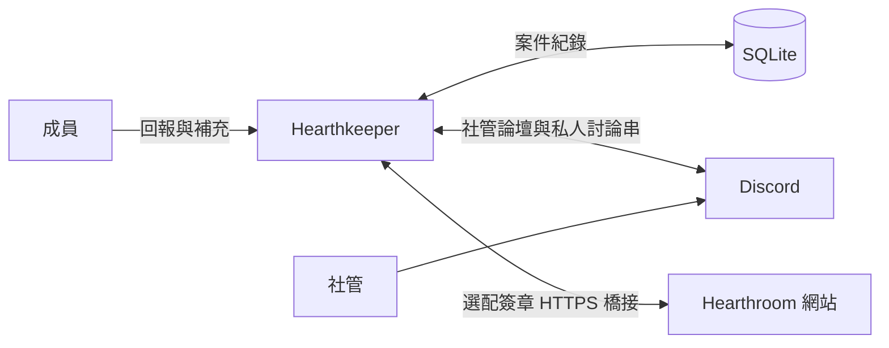

<h1 align="center">Hearthkeeper</h1>

<p align="center">
  開源 Discord 社群支援機器人：私密回報、匿名回饋，以及共同處理的案件佇列。<br>
  為 Hearthroom 打造，以 Node.js 與 SQLite 自行架設。
</p>

<p align="center">
  <a href="https://hearthroom.club"></a>
  <a href="https://discord.gg/C7m85YPHmK"></a>
  <a href="https://github.com/hearthroom/hearthkeeper/actions/workflows/ci.yml"></a>
  <a href="LICENSE"></a>
  <a href="https://github.com/hearthroom/hearthkeeper/commits/main"></a>
  <a href="https://github.com/hearthroom/hearthkeeper/stargazers"></a>
</p>

<p align="center">
  <a href="README.md">English</a> ·
  <b>繁體中文</b> ·
  <a href="README.zh-Hans.md">简体中文</a> ·
  <a href="README.ja.md">日本語</a> ·
  <a href="README.ko.md">한국어</a>
</p>

## 概述

Hearthkeeper（爐邊管家）讓成員有地方求助，也讓社管能持續追蹤每一份回報。成員直接在 Discord 送出回報、查看進度、補充資料；社管則在私人論壇認領案件、回覆、留下內部備註與處理結果。

一個 Node.js 程序服務一個 Discord 伺服器，以 SQLite 保存案件，透過 Discord Gateway 連線。案件功能可獨立運作；連接 [Hearthroom 網站](https://github.com/hearthroom/hearthroom)後，還能提供帳號連結、社群獎勵、通知，以及網站端的案件入口。

不需要 AI 服務、GPU 或對外開放的連入埠。管理決定由社管做出。

## 功能

- **問題回報與回饋**：支援功能異常、儲值問題、帳號問題、角色卡錯誤、審核疑問及角色卡檢舉。
- **私密對話**：可為新的具名回報建立私人討論串，讓回報人與社管直接交談、傳送附件。
- **匿名代轉**：成員可送出與補充回報，承辦介面不顯示其 Discord 帳號。
- **案件追蹤**：認領、要求補充、回覆、內部備註、記錄結果、結案與重開。論壇標籤反映進度；封存討論串與結案是不同操作。
- **持久化投遞**：SQLite 保存待處理工作與投遞紀錄，重新啟動後能繼續同步。
- **選配網站整合**：帳號連結、發言經驗值與等級、展示身分組、公開非成人角色卡預覽、自願訂閱的通知、網站案件，以及經核實的伺服器加成／頭像／裝飾同步。
- **維運工具**：僅限本機的健康檢查、Prometheus 指標，以及 systemd 服務範本。

內建回報分類為 Hearthroom 的使用情境設計。調整分類須修改 `src/cases/catalog.ts`，並同步調整論壇設定。

README 提供五種語言。Bot 介面目前使用英文與繁體中文；部分案件操作與必要論壇標籤僅使用繁體中文。

## 使用方式

加入 [Hearthroom Discord 社群](https://discord.gg/C7m85YPHmK)，或請伺服器管理員[自行架設](#自行架設)。

1. 開啟 `/hearthkeeper`，選擇分類與私密／匿名模式，填寫表單。也可用 `/feedback` 直接進入回報。
2. 用 `/myreports` 查看回覆、補充內容，或申請結案與重開；不需要開啟 Discord 私訊就能追蹤案件。
3. 具名回報在私人對話功能已設定、討論串準備好後，會顯示入口連結。匿名案件維持代轉方式。
4. 授權社管透過 `/cases` 或社管論壇面板認領、回覆與記錄結果。論壇裡的一般聊天不會代轉給成員，對外回覆請使用案件回覆操作。

| 指令 | 用途 | 啟用條件 |
|---|---|---|
| `/hearthkeeper` | 開啟社群選單 | 基本功能 |
| `/ping` | 確認 Bot 是否回應 | 基本功能 |
| `/feedback` | 提出私密或匿名回報 | 已啟用案件功能 |
| `/myreports` | 查看與補充自己的回報 | 已啟用案件功能 |
| `/cases` | 處理案件佇列 | 已啟用案件功能；限授權社管 |
| `/link` | 查看帳號連結狀態並前往網站 | 已啟用網站整合 |
| `/level` | 查看自己的社群經驗值與等級 | 已啟用網站整合 |
| `/xp enabled:false` / `/xp enabled:true` | 停止或恢復未來的發言計分 | 已啟用網站整合 |
| `/subscriptions` | 開啟網站通知設定 | 已啟用網站整合 |
| `/card number:<number>` | 預覽公開、非成人角色卡 | 已啟用網站整合 |

指令回覆僅操作本人可見。案件貼文與私人討論串則依各自的權限設定開放存取。

## 隱私與功能範圍

**私密與匿名不同。** 私人討論串會向社管顯示回報人的 Discord 帳號。匿名代轉不在承辦介面顯示帳號，但 Bot 仍保存加密的身分對應；不承諾對維運者、Discord 管理員或回報內容本身提供匿名保障。

社管論壇僅供核准社管使用，回報人不會被加入論壇。Discord 管理員與具有討論串管理權限的人，仍能存取私人討論串。

案件於結案 90 天後進入清理範圍，Discord 端的刪除另行重試；備份與已下載附件須另外管理保存期限。Bot 使用訊息事件，不要求 Message Content 特權 intent；表單與正式案件回覆則會保存為案件資料。

目前未提供自動處分，也未建立檢舉／申訴的獨立承辦組。網站整合不會讓 Discord 社管自動取得網站審核權限。

## 架構



```text
src/main.ts       Gateway 連線與背景同步
src/runtime.ts    指令、健康狀態與 Prometheus 指標
src/config.ts     環境變數驗證與功能設定
src/cases/        案件儲存、權限、互動與 Discord 投遞
src/community/    選配網站橋接、經驗值、身分組與通知
test/             自動化測試
deploy/           systemd 服務範本
docs/             需求、設計與維運文件
```

案件與社群投遞使用各自的 SQLite 資料庫。網站橋接由 Bot 向外發出 HTTPS 請求，健康檢查與指標只綁定 `127.0.0.1`。每個設定的伺服器執行一個 Bot 控制程序，並在重新啟動時保留資料庫與金鑰。

## 開發

使用 **Node.js 24 LTS** 與 npm。執行測試和建置不需要 Discord Token 或網站帳號。

```bash
git clone https://github.com/hearthroom/hearthkeeper.git
cd hearthkeeper
npm ci
npm run check
```

| 指令 | 說明 |
|---|---|
| `npm test` | 執行完整自動化測試 |
| `npm run typecheck` | 檢查 TypeScript 型別，不輸出檔案 |
| `npm run build` | 將 TypeScript 編譯至 `dist/` |
| `npm run check` | 依序執行測試、型別檢查與建置 |
| `npm run register` | 替換此應用程式在指定 Discord 伺服器的指令；需先建置並提供憑證 |
| `npm start` | 啟動已建置的 Bot；需提供憑證 |

### 持續整合

[CI 工作流程](.github/workflows/ci.yml)會在 push 與 Pull Request 時，以 Node.js 24 執行 `npm ci` 和 `npm run check`。不需要 Discord 或網站憑證，也不會部署 Bot；失敗原因可在 GitHub Actions 執行紀錄與日誌中查看。

## 自行架設

先完成[開發](#開發)章節的下載、安裝與建置步驟。到 [Discord Developer Portal](https://discord.com/developers/applications) 建立應用程式：**Bot** 頁面提供 Token，**General Information** 提供 Application ID。在 Discord 用戶端開啟開發者模式後，對伺服器按右鍵複製 ID，填入 `DISCORD_GUILD_ID`。

準備專用 Discord 應用程式，以及能持續執行 Node.js 程序的主機。啟用 Guild Install，使用 `bot` 與 `applications.commands` scopes。Bot 使用 Guilds 與 GuildMessages intents，不需要特權 intents 或 Administrator 權限。

### 1. 設定環境

完成建置後，複製[環境變數範例](.env.example)：

```bash
cp .env.example .env
chmod 600 .env
```

在本機編輯 `.env`，設定 `DISCORD_TOKEN`、`DISCORD_APPLICATION_ID` 與 `DISCORD_GUILD_ID`。不要提交真實憑證或案件資料。

| 設定 | 啟用內容 |
|---|---|
| 三個 `DISCORD_*` 值 | Gateway 連線、`/hearthkeeper` 與 `/ping` |
| `METRICS_PORT` | 選填的本機監控埠，預設 `11940` |
| `CASE_FORUM_ID`、`CASE_STAFF_ROLE_IDS`、`CASE_DATABASE_PATH`、`CASE_IDENTITY_KEY`、`CASE_LOOKUP_KEY` | 回報與案件追蹤，五項須一起設定 |
| `CASE_PRIVATE_PARENT_ID` | 為新的具名回報建立私人討論串；須使用專用一般文字頻道，不是社管論壇 |
| `CASE_PRIVATE_MAX_ACTIVE` | 私人討論串容量保護值，預設 `100` |
| `COMMUNITY_ENABLED=true` 及相關 `COMMUNITY_*` 設定 | 選配 Hearthroom 網站整合，預設關閉 |

案件資料庫須使用絕對路徑，上層目錄須已存在且可寫入。兩把案件金鑰必須不同，各由 32 個隨機位元組轉成 64 個十六進位字元，並與受保護的備份一起妥善保存。

使用下方指令在本機產生案件金鑰。執行兩次，將兩個不同值分別填入對應設定；不要分享輸出內容。

```bash
node -e "console.log(require('node:crypto').randomBytes(32).toString('hex'))"
```

<details>
<summary>案件論壇必要設定</summary>

1. 在指定伺服器建立專用論壇。對 `@everyone` 拒絕 `ViewChannel`，僅允許設定中的社管角色與 Bot 存取。
2. 在論壇授予 Bot `ViewChannel`、`SendMessages`、`EmbedLinks`、`ReadMessageHistory`、`ManageThreads`、`SendMessagesInThreads`。社管角色須可被提及；否則 Bot 需要此論壇的 `MentionEveryone` 權限，才能通知那些角色。
3. 按原樣建立六個分類標籤：功能異常、儲值問題、帳號問題、角色卡錯誤、審核疑問、角色卡檢舉。另外建立「待補充」與「已結案」。
4. 建立下表七個狀態標籤，在同一伺服器上傳對應名稱的自訂表情符號，允許 Bot 使用，並將表情符號指定給對應標籤。名稱與大小寫須一致，請勿翻譯這些設定值。

| 狀態標籤 | 自訂表情符號名稱 |
|---|---|
| 等待中 | `Waiting` |
| 處理中 | `Processing` |
| 等待中（技術） | `Waiting_engineer` |
| 暫停處理 | `In_Progress` |
| 討論中 | `under_discussion` |
| PASS | `Passed` |
| 未採納 | `Not_adopted` |

</details>

啟用案件前，依[部署說明](docs/deployment.md#04-問題回饋狀態)設定社管論壇、身分組權限與精確的標籤／自訂表情符號。請採用其中的 **0.4 狀態標籤**與 **0.5 私密對話**章節；較前面的標籤說明屬於舊版。私人討論串另須符合[專用父頻道權限](docs/technical-design/Private_Reports_0.5.md)。

網站整合需要兩端設定、獨立橋接金鑰與另一個資料庫。獎勵身分組只能用於展示、不帶任何權限，且必須位於 Bot 身分組下方。請閱讀[整合維運指南](docs/operations/community-integration.md)（英文），包含 0.7 贊助者外觀的前置需求。

### 2. 註冊指令並啟動

透過 Discord 的應用程式安裝設定，邀請 Bot 進入指定伺服器。註冊操作只會替換**此應用程式在該伺服器的指令**；啟用會增加指令的功能後，須重新註冊。

程式不會自動讀取 `.env`。本機執行時請明確載入：

```bash
node --env-file=.env dist/src/register.js
node --env-file=.env dist/src/main.js
```

常駐服務請使用 [systemd 範本](deploy/hearthkeeper.service)與[部署說明](docs/deployment.md)。環境變數已注入時，`npm run register` 與 `npm start` 執行相同入口。一般啟動不會註冊指令或建立頻道。

### 3. 驗證實例

保持 Bot 執行，並在同一主機的另一個終端機執行：

```bash
curl -fsS http://127.0.0.1:11940/readyz
curl -fsS http://127.0.0.1:11940/metrics
```

`/healthz` 檢查程序；`/readyz` 只在 Gateway 與指定伺服器就緒時回傳 200。案件功能另須檢查 `hearthkeeper_case_forum_ready`，私人討論串則檢查 `hearthkeeper_case_private_ready`；各自功能設定正確時應為 `1`。

先執行 `/ping`，再用測試成員與社管驗證回報、回覆。第二位一般成員不可存取第一位成員的案件。監控埠請保持僅限本機；服務就緒不代表案件權限或網站整合已驗證。

## 文件

多數設計與部署文件使用繁體中文，整合維運指南使用英文。

- [需求與專案範圍](docs/requirements.md)
- [架構與原始設計](docs/technical-design/Hearthkeeper_TechnicalDesign_20260920_V1.0.md)
- [問題與回饋流程](docs/technical-design/Case_Workflows_0.4.md)
- [私密對話與權限](docs/technical-design/Private_Reports_0.5.md)
- [部署、備份與監控](docs/deployment.md)
- [網站整合與贊助者外觀](docs/operations/community-integration.md)

設計文件也包含規劃中的工作。上方功能表介紹目前原始碼的能力，實際啟用項目由各部署者設定。

## 社群

歡迎到 [Discord](https://discord.gg/C7m85YPHmK)討論與協調開發。可重現的程式問題和功能提案請送至 [GitHub Issues](https://github.com/hearthroom/hearthkeeper/issues)。也可造訪 [Hearthroom](https://hearthroom.club)，認識這個 Bot 所服務的社群。

## 參與貢獻

- **問題與想法**：說明受影響指令、預期行為與重現步驟。使用虛構案件，移除私人資料。
- **程式碼**：每個 Pull Request 聚焦一項變更，為行為修改補上測試，並執行 `npm run check`。Discord 權限驗證請使用測試伺服器。
- **文件與翻譯**：維持五份 README 內容一致。翻譯 README 不會增加 Bot 介面語言，介面在地化是另一項工作。
- **安全問題**：依 [SECURITY.md](SECURITY.md)，私下寄至 **contact@hearthroom.club**。

完整貢獻方式與提交身分說明見 [CONTRIBUTING.md](CONTRIBUTING.md)。外部貢獻者可使用自己的公開身分或化名。

## 授權

[GNU Affero General Public License v3.0](LICENSE)。貢獻內容採相同授權。部署憑證、成員身分與實際案件資料不屬於此公開專案。
