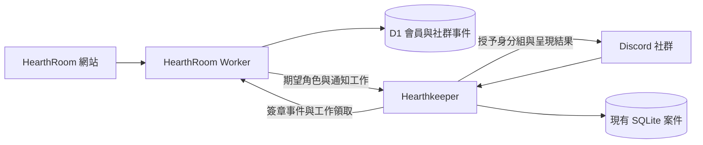
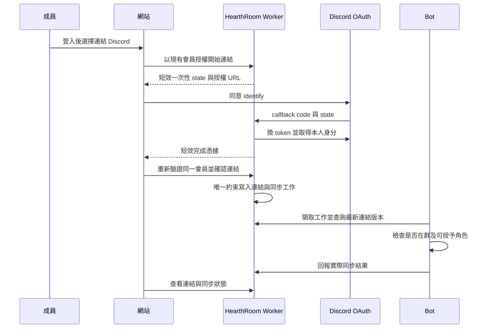
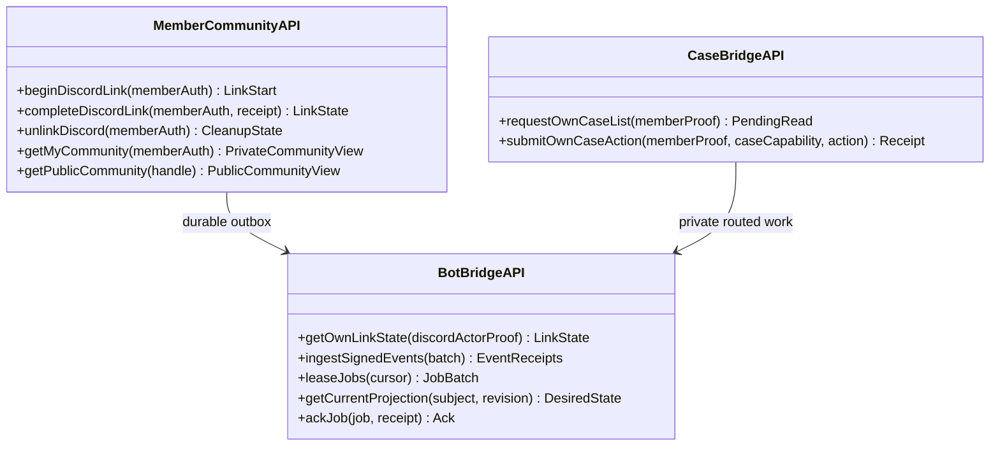

# HearthRoom 與 Hearthkeeper 社群整合技術設計

> 版本：V1.0 · 作者：Hearth Room · 日期：2026-09-20
> 狀態：設計草案；非已實作或上線宣告。

## 修訂紀錄

| 版本 | 日期 | 內容 |
|---|---|---|
| V1.0 | 2026-09-20 | 盤點現有能力，設計身分、成長、作品、案件與通知整合 |

## 1. 需求背景

### 1.1 PRD 引用

- 標題：同一個 HearthRoom 社群的網站與 Discord 入口。
- 版本：2026-09-20 社群整合需求。
- 來源：專案發起人本次需求；發言經驗、等級身分組、帳號綁定、成就徽章、雙向入口，並串接既有功能。
- 補充：每位提案人只能查看自己的案件，並能發言、上傳附件。社管可以看到提案人的 Discord 帳號；需求是對其他一般成員保密。這是存取要求，不代表 Discord 論壇支援逐篇權限。

### 1.2 產品目標

網站與 Discord 是同一社群的兩個入口。網站保有會員、作品、審核與成長資料；bot 提供聊天場景的查詢、通知、身分組與案件入口。綁定後成員不需重新證明作品作者身分、反覆向社管索取身分組，或在兩邊重述同一案件。

首批取代目前需要的 MEE6 發言經驗／等級身分組用途，不宣稱完整複製其所有功能。首版不需要 AI，也不為整合增加第三套帳號系統或常駐服務。

### 1.3 範圍與優先級

| 階段 | 使用者可完成的事 | 驗收標準 |
|---|---|---|
| P0 身分與入口 | 網站加入 Discord、綁定／解除、bot 返回網站與自己個人頁 | 同一 Discord 同時只對應一個會員；兩端顯示一致連結狀態；衝突不合併作品 |
| P1 成長與認證 | 發言經驗、社群等級、成就徽章、對應身分組、自助查詢／重試 | 重送同一事件 10 次只計一次；bot 只能增減明確管理的身分組 |
| P2 既有流程 | 作品預覽／追蹤、審核提醒、卡片問題帶入資訊、跨端我的回報 | 一個業務結果只產生一份紀錄，通知失敗不回滾審核結果 |
| P3 社群活動 | 徵稿／試玩活動、報名與作品關聯、參與徽章、站內精選 | 活動成果可追溯到作品／活動；公開內容需確認；細部活動規則另案 |

本稿交付可實作架構與分期，不把完整產品藍圖一次塞入第一版。XP 數值、稱號名稱、角色 ID 對照及邀請 URL 是上線設定，不在本稿憑空指定正式值。

## 2. 快速參考表（程式審查用）

盤點基準：HearthRoom 主線 `82cea34380b1008a351283c555a8936fffa077f0`；Hearthkeeper `81e99b3370364a642c1c5a63294e1ee4c53b9e01`。下表「已有」指此來源已有程式，沒有替代各功能的正式環境驗收。

| 元件 | 狀態 | 儲存庫／路徑 | 用途與定位 |
|---|---|---|---|
| 社群會員 | 已有 | HearthRoom `src/members.ts` | `requireMember`、`resolveMember`、`memberProfile`；社群 ID 與公開 handle |
| 服務帳號連結 | 已有 | HearthRoom `src/connections.ts` | `linkIdentity`、`EMPTY_MEMBER`、`unlinkIdentity`；連結永久、不可套用 Discord 解綁 |
| 供應商邊界 | 已有 | HearthRoom `src/providers.ts` | `ProviderId` 只有 lunatalk／harbor；Discord 不是對話供應商 |
| 我的頁面 | 已有 | HearthRoom `web/src/pages/MePage.vue`、`components/CommunityProfile.vue`、`components/ConnectedAccounts.vue` | 社群個人資料、作品／書庫及服務帳號入口 |
| 公開作者／會員頁 | 已有 | HearthRoom `src/index.ts` 的 `/v1/authors/:handle`、`src/cards.ts` 的 `getAuthor` | getAuthor 已有無作品會員 fallback，可沿用加公開徽章 |
| 作品與託管版本 | 已有 | HearthRoom `src/card-sync.ts`、`migrations/0021_hosting_versions.sql` | `works`、copies、版本與核准版本；跨平台副本去重 |
| 審核 | 已有 | HearthRoom `src/review.ts`、`src/index.ts` | `claim`、`stamp`；站內 reviewers 資格、初審／重審及版本狀態 |
| 留言 | 已有 | HearthRoom `src/comments.ts` | `postComment`、`deleteComment`、`setLike`；留言可作作品回饋入口 |
| 收藏／追蹤／書庫 | 已有 | HearthRoom `src/library.ts` | 私有 favorites／following／feed／conversations，已有 `/metrics` |
| 私密案件 | 已有 | Hearthkeeper `src/cases/store.ts`、`interactions.ts`、`discord.ts` | 匿名／具名代轉、角色授權、狀態、留存；論壇僅社管可見 |
| Bot 事件／監控 | 已有 | Hearthkeeper `src/main.ts`、`runtime.ts` | MessageCreate metadata、定時投影、loopback `/metrics` |
| 直接 Discord 綁定 | 待開發 | 擬增 HearthRoom `src/community/discord-link.ts` | 獨立 OAuth 社群連結，不擴張 ProviderId |
| XP／成就／角色同步 | 待開發 | 擬增 HearthRoom `src/community/progression.ts`、Hearthkeeper `src/community/` | 事件帳本、規則版本、可重試角色投影 |
| 通知中心／跨端案件 | 待開發 | 擬增 HearthRoom `src/community/notifications.ts`、案件橋接 | 現在沒有完整跨端通知／申訴後台；不能只加 UI 即稱完成 |

## 3. 技術方案設計

### 3.1 整體架構

- 會員主體仍是 HearthRoom `members`；Discord snowflake 全程以字串處理，絕不轉 JavaScript Number。
- HearthRoom D1 是連結、成長規則／帳本、徽章與站內通知的權威資料來源。Discord 身分組是呈現結果，不反向改寫站內權限。
- 現有案件仍由 Hearthkeeper CaseStore 管理；網站以授權橋接呈現，不建立第二份可獨立修改的案件狀態機。
- 沿用 Cloudflare Worker + D1 和 Node + SQLite。Bot 向 Worker 發出 HTTPS 請求及領取 durable outbox，主機不因此新增公開埠。不引入 Redis、Kafka 或 AI。
- Worker 接收事件後在同一 D1 batch 寫入唯一事件、規則結果與 outbox。Bot 本機 outbox 先保存事件，確認接收成功才移除待送狀態。限速依 Discord 回應退避。

### 3.2 綁定流程

目前網站以供應商 bearer 認證，沒有可假定存在的站內 session cookie。因此 callback 不直接憑 URL 的會員 ID 綁定：開始時記錄會員／nonce hash／到期時間；回來先暫存已驗證 Discord 身分，再由前端使用現有有效會員授權完成。state 一次性、短效、綁定起始會員及瀏覽器流程 nonce；完成時兩者與再次登入身分都須一致。OAuth code、token 不進網址後續分享、日誌或 bot 工作 payload；回程頁清除 query，設 no-store 及 no-referrer。完成後撤銷／丟棄使用者 OAuth token，第一版不保存 refresh token。

只有 `identify` 必要；不索取信箱、好友、全部伺服器列表，不使用 `guilds.join` 自動入群。加入 Discord 是獨立邀請連結；是否已在目標 guild 由 bot 以 Get Guild Member 確認。網站綁定成功但尚未入群可顯示「已連結，尚未加入社群」。上游 HarperHarbor 的 Discord 登入不視為此站已取得直接連結證明。

站內 `/me` 與 Discord `/link` 都導向同一綁定流程。Discord 指令以互動中的 guild／本人 Discord actor，透過已簽名 bridge 查詢脫敏 LinkState，ephemeral 顯示未連結、待入群、同步中、完成、失敗或解除待清理，並給官方網站操作入口。查詢不接受使用者輸入 member_id；來源與網站共用 link_version／desired_revision 及實際同步 receipt，快取過期顯示待確認，不能讓使用者輸入任意會員 ID 領別人的徽章。首版不新增「Discord 單獨登入 HearthRoom」；那會涉及站內 session 與復原機制，另案設計。

### 3.3 核心介面契約（擬新增）

新增網站路由統一放 `/v1/me/community/*`、`/v1/community/members/:handle`；bot bridge 放 `/internal/community/*`。這是待實作命名，不能對外宣稱目前可呼叫。所有 member route 沿用 `requireMember`，私有回應 `Cache-Control: private, no-store`；public route 只能輸出成員已同意公開的 handle、顯示名稱、稱號及徽章，沒有 Discord ID／帳號或私人進度。

Bot bridge 採獨立用途金鑰，簽署 method、path、timestamp、nonce、body hash，短效防重播；nonce 重播拒絕，業務 event_id 重送回原 receipt。金鑰限制單一部署／guild 與 operation audience，不接受任意 guild、member_id、角色或案件 owner 由客戶端指定。驗簽後也要逐事件檢查類型、來源、subject 與目前連結版本。網站 webhook／公開分析端點不能充當發獎來源。

### 3.4 資料與生命週期

| 擬新增資料 | 核心約束與責任 |
|---|---|
| `discord_links` | member_id、discord_user_id 各唯一的活動連結；guild 為部署設定；link_version、enabled、public_visibility、created／revoked |
| `discord_link_attempts` | state／receipt 只存 hash，10 分鐘失效，單次消費；不寫公開日誌 |
| `community_events` | 唯一 source + event_id，subject、kind、規則版本、event_time、received_time；不存訊息正文 |
| `xp_ledger` | 每個唯一事件的增減值及理由，禁止直接覆蓋總分；更正是可稽核反向事件 |
| `achievement_awards` | subject + achievement_key + qualifying_object 唯一；授予／撤回及規則版本 |
| `community_outbox` | lease、retry_at、desired_revision、link_version、target audience、完成 receipt；過期工作不覆蓋新狀態 |
| `member_notifications` | 自己的通知、已讀、原事件鍵，內容與可見範圍分開，來源不複製私人正文 |
| `role_projection_receipts` | 哪些角色由 bot 管理及授予，實際讀回時間／狀態，非全部角色鏡像 |
| Bot SQLite `case_projections` | case_id + kind（staff_forum／member_private_thread）唯一；各自 external_id、desired／applied revision、成員集合版本、投遞游標、archive／lock 狀態與可重試刪除 receipt；既有 thread_id 只代表論壇，不重用為私人串 |

網站貢獻記在會員主體；Discord 發言經驗記在該 Discord 主體。綁定只合併顯示與計算資格，不複製或搬移歷史 XP；解除後兩份來源各自保留，不讓重新綁定重領獎。尚未綁站的 Discord 成員可使用純 Discord 發言等級；綁定後才額外計入站內貢獻。公開排行榜預設不啟用，僅本人查詢；計分頻道需告知規則並提供停止計分入口。

解除時立刻停止跨端身分查詢與新投放、提升 link_version，撤掉只因綁定而得的 bot 管理角色。純 Discord 發言角色可保留，由該 Discord 主體的等級重新計算；站內創作成就保留。清理結果讀回前不允許將舊 Discord 移給另一會員或把同會員切到另一 Discord，避免兩帳同時持有連結獎勵。舊工作執行前必須重新取得最新 desired_revision，先撤錯誤角色再授新角色。

新 member-scoped 資料須納入 `connections.ts` 的 `EMPTY_MEMBER`：有 Discord 連結、XP、成就、通知或案件關聯的會員不可被當空白帳號吸收。一般會員全域刪帳目前沒有完整路徑，本期不宣稱提供；Discord 解綁立即清除可公開連結，通知／橋接快取建議 30 天清除，敏感票據 10 分鐘，XP 原事件去重資料與彙總留存須在啟用前公告。既有案件結案後 90 天保留契約繼續適用，網站不能另留永久副本。

## 4. 詳細設計

### 4.1 「我的社群」入口

網站 `/me` 增加獨立「Discord 社群」卡片：加入社群、連結帳號、目前連結的顯示名稱、等級與進度、已取得徽章、角色同步結果、重新同步、解除連結。下方列我的通知／回報，與既有服務帳號卡分開。

狀態要區分：未連結、連結中、已連結未入群、已入群待同步、同步完成、權限不足／暫時失敗、已解除待清理。同步失敗不顯示「已領取」；可重試而不重複發獎。展示 Discord 帳號與可識別作者頁跳轉採明確公開選擇，綁定不等於同意公開。

沿用既有作者／會員頁的無作品 fallback，加入共用公開徽章元件，不另建一套個人頁。新 community API 只補成長資料，作者頁仍用既有 URL。作品詳情與留言作者列可顯示少量已公開徽章，點擊回同一會員頁；不在每則留言列出 Discord 帳號。網站頁首／頁尾及加入引導放官方 Discord 邀請，bot 選單放網站／指南／個人頁。連結不是強制加入群，瀏覽公開作品不因未綁定而受阻。

### 4.2 成長與身分組

成長分三類：活躍等級（聊天與參與）、創作成就（作品／活動）、管理職責。前兩者可顯示徽章與指定身分組；管理職責仍由明確人工授權。等級不發審核、技術、管理員權限，也不自動提高付款額度或作品發布配額。

發言計分只處理指定公開交流頻道的真實成員 MessageCreate；排除 bot、webhook、系統訊息、工單、私密社管頻道。不讀內容、不按字數或反應量給分。每人冷卻及每日上限由中央版本規則設定，事件唯一鍵以 guild + message ID 計算；編輯不重計，Gateway 重播不重計。不上線前掃歷史估算，不承諾補回 bot 離線時漏掉的發言。刪訊不自動回扣，避免 Discord 刪訊事件漏接導致不一致；社管確定洗分時以可稽核修正事件扣回，亦不因封禁自動清空站內貢獻。中央以 event_time、規則生效窗口及穩定桶鍵核對冷卻／每日上限，遲到批次重送不套用接收日重領額度；超過接受窗口的事件拒絕並回傳原因，不暗中改時區或回填歷史。此方案能限制刷頻，但無法在不讀內容時判斷每句是否有價值。

建議初始試行參數為每 60 秒至多一次、每日 60 次有效發言；這是可調候選值，先 shadow 計算及社管驗看，再啟用正式獎勵。公告說明、停止／恢復計分、季節重置與終身成就分開；首版不做消耗型積分、不兌換金錢／模型點數。

首批站內成就可選「第一個經審核公開的作品」「參與一次完成的試玩活動」「建議獲採納」。以 canonical work／review version／活動紀錄作唯一事實；同作品多家託管、重送或重審不能重發首次發表成就。回報獎勵預設私有，匿名案件不產生可反查個人的公開徽章，公開需另外同意。

自動角色使用 bot 專用 allowlist，不以名稱模糊比對，不編輯整份 member.roles；只對指定 role 使用增／刪 endpoint。需要 Manage Roles 且目標角色低於 bot；受管理／整合角色及具管理能力的角色拒絕配置。既有社管三角色只作案件授權，絕不加入自助領取列表。只映射無敏感頻道權限的展示角色；若要解鎖私密區，需另外審查當下的 channel overwrites，不能從名稱推斷安全。每次授予前以當下權限或具版本的短效安全快照重驗角色及頻道覆寫；設定漂移即停止新授予、標記 denied／待處理並告警，待人工重新核准。既有角色是否撤回依事先核准的政策處理，不擴大刪除人工角色。

離群不刪成就，在群資格撤回；重新加入後重算。首版不加特權 Guild Members intent，以綁定／查詢／執行角色工作時的 REST 及定期分頁複查取得會員狀態，不能承諾瞬間得知離群；成員狀態逾期顯示待確認。若日後需要即時入退群事件再啟用相應 intent。Discord 原生 Linked Roles 可列後續相容選項，但其額外 OAuth scope 與領取流程不能冒充目前 bot 的自動授予。

### 4.3 與現有功能的深度整合

| 現有入口 | 整合後的自然流程 | 執行與可見邊界 |
|---|---|---|
| 作品頁／作者頁 | 分享已核准作品到 Discord，顯示標題、作者、公開摘要、前往網站；作者展示創作徽章 | 僅已公開可見版本；不拷貝私有設定、審核快照或聊天內容 |
| 收藏與追蹤 | 可選擇接收追蹤作者的新作品／更新摘要，Discord `/subscriptions` 回到網站管理 | 收藏／追蹤名單仍私有；不把全部名單變公開角色；通知另行同意 |
| 作品評論 | 從 Discord 前往同一作品的站內討論，站內回覆可進通知中心 | 首期不雙向鏡像原始留言；刪除、審核、退訂以網站為準 |
| 審核佇列 | 私密社管頻道提示有新待審件，點開站內領取與蓋章；作者收到結果入口 | reviewers 才有審核資格；提醒只含待辦入口／數量，不 @作者或公開作者資料，保留盲審；Discord 社管角色不自動取得 reviewer；PASS 回報不代表審核核准 |
| 卡片錯誤／卡片檢舉 | 網站一鍵回報自動附公開卡號、canonical work、hosting version；bot 選單接受同一公開連結 | 同一案件處理，不讓使用者提交的 URL 成為服務端任意抓取入口；必要資料由本站解析 |
| 審核疑問／申訴 | 帶入審核單與版本，站內看處理結果，Discord 用既有案件工作流承辦 | 處理意見與正式審核 verdict 分開；歷史版本不混成目前版本 |
| BUG／帳號／儲值問題 | 從對應網站頁打開支援，可主動附頁面、公開錯誤碼及本人確認的服務來源 | 不自動附 token、付款憑證、聊天紀錄；bot 不修改餘額、退款或帳號權益 |
| 我的回報 | 網站與 Discord 都能查自己的案件、補充及查看回覆，關閉結果共用 | staff-only 備註不外送；綁站不把舊匿名案轉具名；case store 仍唯一狀態權威 |
| 寫卡／試玩入口 | bot 指令找到寫卡指南、公開卡片、官方試玩活動；成功事件形成創作里程碑 | AI 試玩仍在既有 Provider，不把 bot 改成另一個 AI 推理後端 |
| 社群營運 | 成員轉換、同步成功率、待處理數與活動參與趨勢 | 只聚合資料；不為成長分數輸出聊天全文或私人跟隨關係 |

站內更新、Discord 說話與 bot 處理案件都成為有明確來源的社群事件，不互相直接改對方資料庫。

### 4.4 案件存取與附件

Discord 論壇貼文繼承論壇權限，不支援替單篇設定會員 permission overwrites。直接加入 thread 也不能繞過父頻道 View Channel。**因此不會為了讓提案人看自己的案件而開放整個社管論壇。**

既有匿名模式繼續由 bot 代轉。網站綁定只建立本人存取橋接，不把會員 handle、Discord ID 寫入社管案件或公開事件。既有案件跨端查詢需目前雙端身分證明，且綁定時成員明確啟用「在網站查看我的回報」；不自動批次匯出案件。站內／bot 所見都套用 CaseStore 的 owner／staff 與內部事件過濾規則。

新增網站案件讀寫走短效授權工作：Worker 用本人驗證建立 audience=case_owner 的 opaque 請求；Bot 拉取後用現有 CaseStore 判權，不接受瀏覽器直接宣稱 staff；結果限本人讀取、短效加密快取，過期刪除。補充／關閉請求帶 case version 和冪等 request key；網站顯示待同步直到 CaseStore durable receipt，超時以 receipt 查回，不能盲目再開單。社管回覆仍由具角色的 Discord 互動產生，首期不加網站社管控制台。

本人授權必須落到既有 CaseStore Actor：Worker 只從已驗證 member 的目前 active discord_link 解析 Discord subject，以受限橋接憑據固定 guild、member、Discord subject、link_version、case_id（列舉時為 owner scope）、action、case version、request key、expiry 與 audience。Bot 執行前向 Worker 重新驗證目前 link_version／短效租約，失敗關閉；再用同一 guild + Discord userId 產生既有 owner_key，只建 owner Actor，絕不沿用網站提供的 staff 布林值或角色。沿用 CaseStore 現有能力的 actor／案件／動作／版本／期限檢查，瀏覽器不能覆寫 subject。解除立即提升版本並禁止核發新租約；已領取但尚未取得有效執行租約的工作拒絕，已原子提交的動作保留稽核結果而不假裝撤銷。解除完成須等既有短效執行租約收斂；網站在解除起始就拒絕讀取私有結果。回應以原 member 與一次性 receipt 綁定、領取時再驗連結；不能把 bearer case capability 放入分享 URL。

依發起人確認，預設採「私密回報」：社管可辨識提案人，一般成員只能看自己的案件。採「專用一般文字入口＋每案私人討論串」，而非每案新增文字頻道：入口只有說明，成員可看入口、在討論串發言及傳附件，但不能在入口發言或自行開串；bot 建立 private thread、設定 invitable=false，加入該提案人及核准承辦人。論壇維持只供社管；不改論壇 @everyone deny，也不靠把人加進論壇貼文假裝達成隔離。

私人討論串不能在 forum 建立，提案人仍須能看專用文字父頻道；這是新入口權限，不是單篇 ACL。一般成員看不到其他人的私人串，但 Manage Threads／管理員可依 Discord 權限看見。提案人在裡面發言會向承辦人顯示 Discord 身分，所以名稱必須叫「私密回報」，不能叫匿名。真正匿名仍以表單／附件指令或網站回報由 bot 代轉，兩種模式清楚區分。

Private thread 不占一般頻道名額，但有活躍討論串上限；結案立即 archived=true、locked=true，沿既有每人最多三件開案限制，並加入整體活躍容量保護。接近 API 限額時新案仍可接受表單回報，明示直接對話暫不可用，不能丟案件或自動放寬權限。結案後 90 天的既有清除流程擴及關聯私人串／附件，失敗保留 retryable deletion ledger；留檔期間是封存而非永久無限建立。bot 自動建立／加入／關閉，不要社管逐案手動設權限。站內案件紀錄優先保存正式回報、對外回覆與結果，不未經同意鏡像整段對話。

兩種 Discord 投影必須分開收斂：論壇保留社管工作流／內部備註，私人串只呈現提案人已提交內容、標記為對外的社管回覆及可公開的案件狀態；內部備註、匿名 owner 對照與稽核事件永不外送。私人串中的日常交談不自動回灌案件紀錄或全量鏡像論壇；正式補充／對外回覆使用案件按鈕／指令，才進 CaseStore 事件與投影。

建立使用 case + projection_kind 的唯一工作；外部建立後崩潰時，以投影專屬非個人識別標記、指定 parent／type 查回並持久化 external_id，無法證實時保留待核對，不盲目再建。事件投遞以 case_event + projection_kind 去重，分別保存 cursor；成員加入／移除以核准集合版本讀回。封存／鎖定以 case revision 設定各目標並讀回，舊工作不能重開新已結案狀態；私人串手動封存不等於業務結案。90 天到期時各投影／附件獨立記刪除 receipt，404 視已刪、其餘失敗重試；全部目標確認後才完成案件清除，不讓論壇成功掩蓋私人串殘留。

每案私人文字頻道只列例外備案；會占用頻道配額，關案不能釋放配額，另需關閉後清理，故不是預設。本稿確認模式，不代表已完成實作或已變更 Discord 權限；啟用時只配置專用父頻道與必要的 Create Private Threads／Manage Threads，不因方案而索取 Administrator。

匿名附件應經明確上傳操作走網站私有儲存及案件能力網址，不把公開 Discord CDN 連結當永久私密儲存；檔案上限、類型、掃描與下載授權須一起實作，並依案件保留政策清除。具名私人討論串直接使用 Discord 附件，不自動複製至網站。附件內容可能自行揭露身分，維持既有提示。

## 5. 平台適配

網站是現有 Vue 3 Web／Cloudflare Worker，覆蓋桌面與手機瀏覽器，不套用不相干的 uni-app 條件編譯。手機從 Discord 內建瀏覽器切往 OAuth 後須可回原流程；未登入先登入，不丟綁定來源。Bot 原生 slash command、button、modal 在 Discord 桌面與手機驗證。網站 API 不可依賴 Discord 客戶端持有 Provider token。

## 6. 多語言支持

HearthRoom 沿用 `web/src/locales/{zh-Hant,zh-Hans,en,ja,ko}.json`。Bot 首期維持 zh-TW／en fallback，再按社群需求擴充；訊息保存語言鍵與參數，由接收者偏好渲染，原始作品與回報文字不自動翻譯。發言計分不依語言區別。

| Key | zh-Hant | zh-Hans | en | ja | ko |
|---|---|---|---|---|---|
| community.discord.connect | 連結 Discord | 连接 Discord | Connect Discord | Discord を連携 | Discord 연결 |
| community.discord.join | 加入社群 | 加入社区 | Join the community | コミュニティに参加 | 커뮤니티 참여 |
| community.sync.pending | 身分組同步中 | 身份组同步中 | Roles syncing | ロールを同期中 | 역할 동기화 중 |
| community.badges | 社群徽章 | 社区徽章 | Community badges | コミュニティバッジ | 커뮤니티 배지 |
| community.link.conflict | 此 Discord 已連結其他帳號 | 此 Discord 已连接其他账号 | Discord is linked to another account | この Discord は別のアカウントと連携済みです | 다른 계정에 연결된 Discord입니다 |

這是設計用譯文草稿，ja／ko 實作時仍需語境驗收。稱號與成就名稱另有翻譯鍵，不把中文角色名稱當資料主鍵。

## 7. 風險與設計限制

| 風險 | 處理方式 |
|---|---|
| 自動合併錯帳 | 兩端即時證明、唯一連結、衝突拒絕；不依同信箱／暱稱推斷 |
| 解除後仍拿到角色 | link_version、最新投影檢查、舊工作失效、durable 撤回工作與讀回；清理前不換綁 |
| 成就變成權限提升 | 管理資格獨立；角色 allowlist、位置與有效權限預檢；不更動作品配額／付費權益 |
| 洗經驗 | 冷卻、上限、禁止從公開 analytics 事件發獎、唯一事實去重；不宣稱可辨識內容品質 |
| 私人內容經通知外洩 | 私密站內通知、Discord 預設只發安全入口；DM 需 opt-in，失敗回站內；私有內容不進公開 embed |
| 推薦公開卡片後下架 | 發送前重新檢查版本、可見性及 NSFW；已張貼的 bot 預覽納入撤回／更新工作，無法完全抹除平台外部快取 |
| 串接全面封鎖造成誤傷 | 帳號處分、Discord 禁言／封禁不做自動雙向同步；未來明確制定規則再做 |
| 高事件量壓垮 D1 | 本地先去重／冷卻／排隊批送，中央再驗一次；有限批次與退避，設定來源速率上限 |
| 計分規則改動 | 規則版本與生效時間；不自動追溯重算／清零，shadow 比較後再生效 |

NSFW 不以加入成人 Discord 或拿到角色替代網站年齡／顯示偏好。公開摘要只發到符合設定的頻道；無法確認接收範圍時只送不含敏感標題／圖像的站內入口。Private API、歷史對話與 private role config 保持原權限。

## 8. 驗證與可觀測性

### 8.1 可執行驗收

- 綁定成功、取消、過期、重播、另一瀏覽器／會員接手、雙帳衝突都走自然瀏覽器路徑；預覽不寫正式連結。
- 未綁 Discord 成員可查發言等級；綁定不重計歷史；換綁／解除不複製 XP、不改作品所有權。
- 同一有效事件重送 10 次只一筆 ledger；一次正式規則變更不改歷史事件的規則版本。
- bot 被移高／移低、角色刪除、Manage Roles 撤回、成員離群、429／5xx、斷線重啟都能回報 pending／failed 而非假成功。
- 匿名案件綁定前後社管可見輸出不得新增任何帳號身分；非本人、非核准社管不能看內部事件或附件。
- 作品改版／重審不推播未核准版本，多 provider copy 不重發獎；私有收藏、追蹤及對話紀錄不出現在公開 badge API。
- P0／P1 在正常 Discord API 情況下，已接受的同步工作目標 2 分鐘內完成；超過 5 分鐘顯示待同步並進監控。這是目標，需壓測與正式讀回才能聲稱達成。

維護性程式更動先 Red/Green：HearthRoom API＋web 全套測試、typecheck／build；Hearthkeeper `npm run check`。文件階段只驗證設計、引用及 Mermaid，不偽造 TDD。網站加桌面／手機與五語行為；Discord 加兩種 locale 原生路徑。只測影響的獨立倉庫，不能用局部通過代替完整可信集。

### 8.2 Prometheus

| 指標 | 型別／低基數 labels | 發送點 |
|---|---|---|
| `hearthroom_community_link_total` | counter, operation=start/complete/unlink, outcome=success/denied/error | 完成該狀態的 durable 寫入／拒絕／失敗 |
| `hearthroom_community_events_total` | counter, kind=message/creation/achievement, outcome=accepted/duplicate/rejected | 事件 ingest 結果 |
| `hearthroom_community_jobs_pending` | gauge, kind=role/notification/case | 未完成 outbox 量 |
| `hearthroom_community_oldest_job_seconds` | gauge, kind 同上 | 最舊可執行待送工作年齡 |
| `hearthkeeper_role_sync_total` | counter, operation=grant/revoke, outcome=success/denied/retry | Discord REST 加上獨立讀回 |
| `hearthkeeper_community_sync_seconds` | histogram, kind=role/notification/case | 接收工作至 durable 確認時間 |

網站沿用唯一 `/metrics` 輸出，擴充目前 `libraryRoutes` exporter，不新增同路徑 handler 遮住舊指標；Worker counter 以 D1 儲存，不能靠 isolate 記憶體充當總數。Bot 沿用 loopback exporter。所有 labels 不含會員、Discord、卡片、案件 ID、token 或訊息；測試覆蓋 accepted／duplicate／denied、重試及讀回失敗 emission。

部署驗證：`sum(hearthroom_community_jobs_pending)`、`max(hearthroom_community_oldest_job_seconds) < 300`、`sum(increase(hearthkeeper_role_sync_total{outcome="retry"}[15m]))`，以及兩端 `/metrics` 原始讀回；搭配測試會員實際角色，不以 counter 代替角色存在證據。業務成效看加入→綁定→同步完成轉換、每週參與及已處理回報數，僅聚合，不與帳號 ID 放在 metric label 中。

### 8.3 MCP 決策

首批綁定／解除 OAuth 與 Discord 角色操作不直接對 MCP agent 開放，必須由本人完成驗證；server 目前的 Provider MCP 沒有 HearthRoom 社群身分授權，不能拿上游 accountNumId 冒認社群會員。公共成就目錄／公開徽章讀取未來可透過 HearthRoom 授權適配層接入，屬獨立範圍；私人通知／案件待建立同一會員 ownership 與 scope 後才暴露。這是明確的不適用於現有 server MCP 的邊界，非宣稱已完成 MCP 支援。

## 9. 上線計畫

1. **先完成既有 0.4 上線**：正式版本依部署流程完成完整測試及獨立讀回；營運狀態另留私有紀錄。深度整合不能宣稱已經包含在這版。
2. **P0 連結與互通入口**：新增 schema／OAuth callback／我的社群卡／邀請設定；先本人及社管測試，唯讀顯示連結與在群狀態。
3. **P1 影子計分及角色投影**：計分規則候選、成就目錄、dry-run 差異表；確認正式稱號及 bot 管理的角色後開啟寫入。預計先上「社群會員、發言等級、首個公開作品」三種用途。
4. **P2a 核心既有流程**：審核提醒／結果、帶作品資訊回報與站內我的回報。
5. **P2b 對話與訂閱**：私密回報的私人討論串、訂閱摘要分開驗收，不阻擋 P2a；既有匿名案件維持原匿名性，不自動搬入具名討論串。
6. **P3 活動／策展**：從實際徵稿與試玩需求選一個完整活動先做，不預先搭龐大商城或點數經濟。

分期成效先以 shadow／小流量建立基準，再由社管設定正式目標：P0 檢查加入至綁定及解除完成率；P1 檢查有效參與、同步成功率與刷分／停用率；P2 檢查回報完成率、處理時間及跨端重複開案率。權限外洩或重複發獎立即停新授予／對話啟用；同步失敗與負擔惡化則暫緩下一階段，先修復及讀回，不以功能開關已開作完成標準。

每階段獨立開關（link／xp／role-write／notification／case-bridge）；資料 migration 採 additive。回滾先停新事件與角色授予，撤回清理 lane 保持可運行直到收斂；保留 ledger／outbox，不直接清空或退回不理解新狀態的版本。Hearthkeeper 按推送來源部署，網站走自身 CI，不修改其他服務。

啟用前需有：正式 Discord 邀請 URL、OAuth callback 和獨立密鑰、bot 可管理角色對照與階層、計分頻道與規則公告、徽章公開／通知設定，以及私密回報入口的權限驗收。設定未齊時功能顯示未啟用，不使用測試值自動發放權限。

## 10. 附錄

### 10.1 官方依據

- [Discord OAuth2](https://docs.discord.com/developers/topics/oauth2)：identify、state、授權碼流程。
- [Discord 權限與角色階層](https://docs.discord.com/developers/topics/permissions)：Manage Roles、可授予角色階層，以及 thread 繼承權限。
- [Discord Guild 角色增減 API](https://docs.discord.com/developers/resources/guild#add-guild-member-role)：成員角色操作與讀回。
- [Linked Roles](https://docs.discord.com/developers/tutorials/configuring-app-metadata-for-linked-roles)：未來選項，需要額外 scope／使用者流程。
- [Threads](https://docs.discord.com/developers/topics/threads)：forum／private thread 與父頻道存取限制。

### 10.2 本稿未涵蓋

AI 社群聊天、付費點數兌換、跨站自動封禁、全量聊天同步、公開私人收藏／對話、任意自動授予社管／reviewer、Discord 直接獨立登入、網站社管案件後台、歷史訊息 XP 回填及正式全站刪帳。以上不是完成宣告，也不構成額外執行授權。
