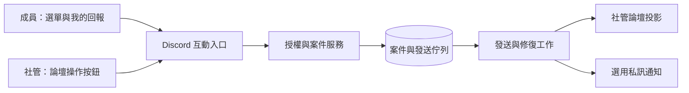
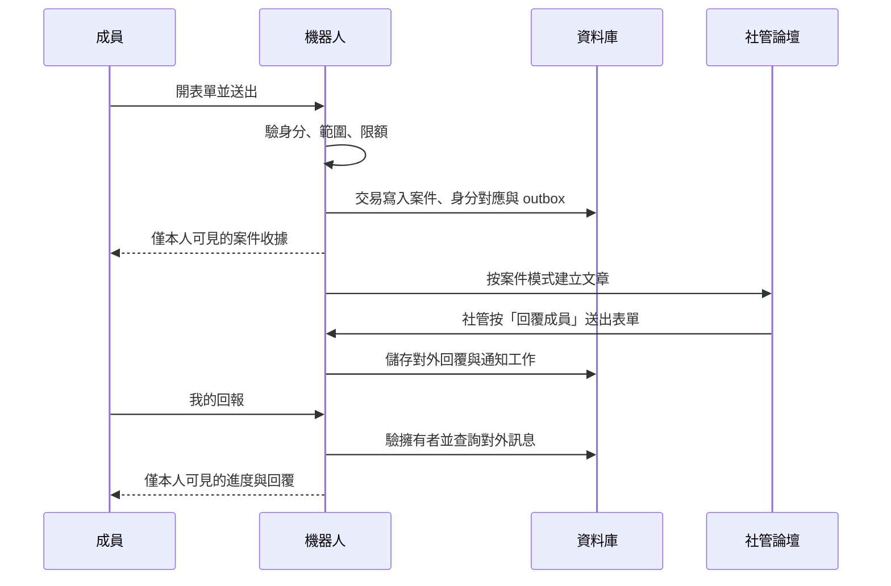
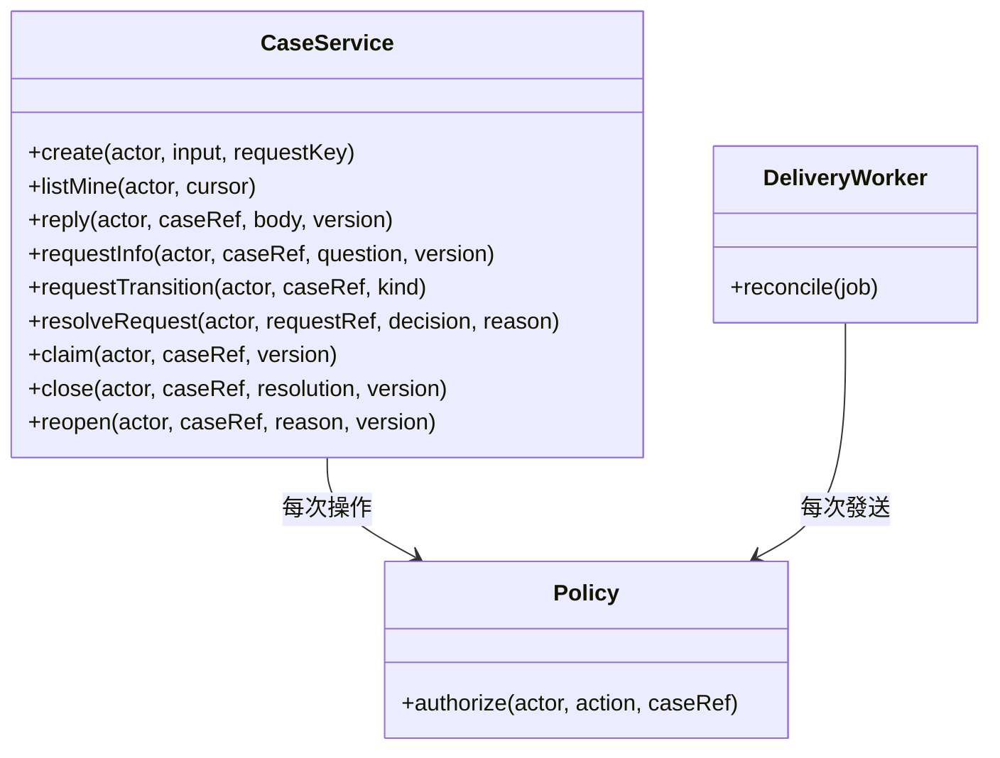
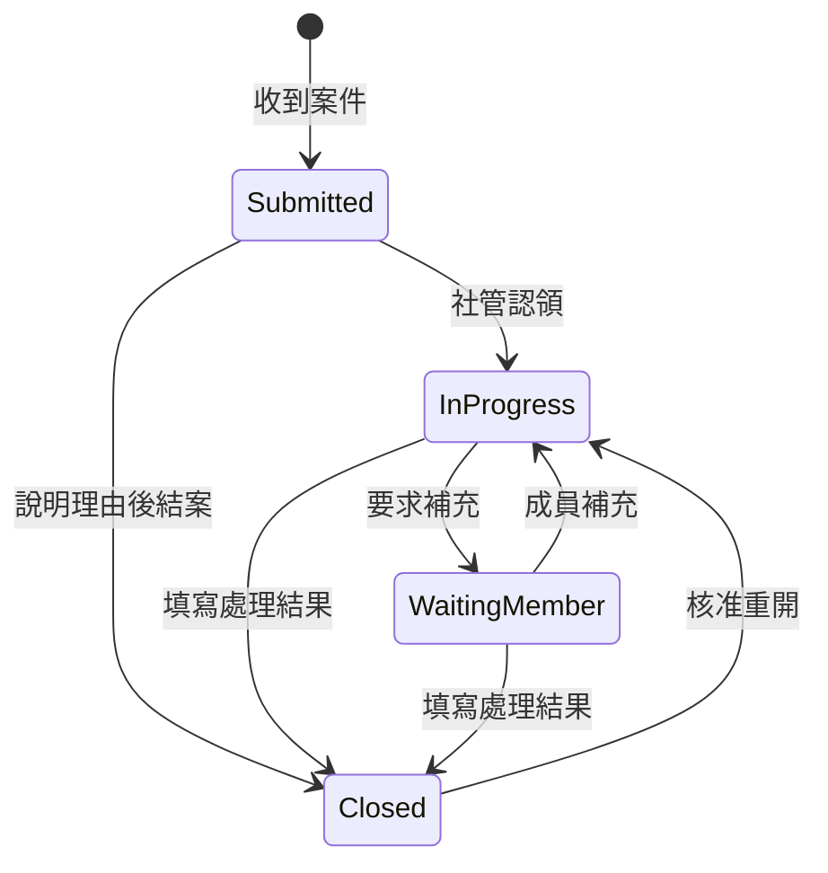

# Hearthkeeper 技術設計

> 版本：V1.0 · 日期：2026-09-20 · 作者：Hearth Room
> 狀態：M1 設計提案；0.1.0 已有獨立的連線基礎實作，完整案件能力仍未實作。
> 現行可用範圍以 [部署說明](../deployment.md) 為準，本表不代表部署驗收收據。

Hearthkeeper 讓 Discord 成員透過表單提出回報，社管在專用論壇處理。
成員從「我的回報」補充與查看結果，不需要加入社管論壇，也不依賴私訊。
本文供社管確認操作規則，供開發者實作並驗證第一版。

## 術語

| 名稱 | 意思 |
|---|---|
| 案件 | 一份回報及其補充、回覆、狀態與處理結果 |
| 匿名代轉 | 機器人代送內容，向承辦社管隱藏回報人的帳號 |
| 私密回報 | 非公開案件；承辦社管可看見回報人帳號 |
| 內部備註 | 只供社管協作的內容，永不自動轉給成員 |
| 發送佇列（outbox） | 與案件一併存入資料庫、稍後送到 Discord 的工作 |
| 冪等 | 相同操作重送時，不重複建立案件或執行處分 |

## 修訂紀錄

| 版本 | 日期 | 內容 |
|---|---|---|
| V1.0 | 2026-09-20 | 第一版範圍、匿名代轉、權限、資料保存與驗收設計 |

## 1. 需求背景

### 1.1 需求來源

- 名稱：[Hearthkeeper 產品需求](../requirements.md)。
- 版本：V1.0。
- 來源：專案發起人確認的社群管理機器人提案；本文件是可公開的需求整理。
- 專案：`hearthroom/hearthkeeper`；Discord 名稱：爐邊管家。

### 1.2 目標與範圍

第一版完成案件生命週期、服務選單、通知身分組，以及人工警告與限時禁言。
社管可認領、分類、要求補充、回覆、結案及重開案件。
創作相關功能先提供指南與試玩模板；作品連動、公開建議和活動功能另分版本。

| 優先度 | 需求 | 驗收入口 |
|---|---|---|
| P0 | 私密／匿名回報與我的回報 | HK-01 至 HK-07、HK-19、HK-20 |
| P0 | 權限、資料保存、失敗恢復 | HK-08 至 HK-15、HK-23 |
| P1 | 指南、通知身分組、人工處分 | HK-16 至 HK-18、HK-21、HK-22 |
| 後續 | 公開建議、作品預覽、站內綁定、活動 | 不屬於 M1 驗收 |

### 1.3 平台限制

Discord 論壇文章繼承父頻道權限；不能用逐篇覆寫權限隔離不同回報人。
私人討論串只能建立在一般文字頻道。M1 因此讓社管使用論壇，成員使用互動式查案。
鎖定與封存只是 Discord 顯示／操作狀態，資料庫的案件狀態才代表是否結案。[1]

## 2. 快速參考表

下列 M1 模組均為**規劃路徑，尚不存在**。0.1.0 的 `src/runtime.ts`、
`src/main.ts` 與 `src/health.ts` 僅提供連線、選單與監控基礎。

| 元件 | 狀態 | 預定路徑 | 責任／主要操作 |
|---|---|---|---|
| Discord 入口 | 待開發 | `src/discord/` | 指令、按鈕、表單與回應 |
| 案件服務 | 待開發 | `src/cases/` | create、reply、claim、close、reopen |
| 授權服務 | 待開發 | `src/authz/` | 所有入口與發送前的 guild、擁有者及角色檢查 |
| 資料庫 | 待開發 | `src/storage/`、`migrations/` | 交易、版本條件更新、身分對應 |
| 發送與修復 | 待開發 | `src/jobs/` | outbox、限流、投影核對、保存期限 |
| 社群管理 | 待開發 | `src/moderation/` | 警告、限時禁言、撤銷、申訴 |
| 社群站連接 | M2 | `src/integrations/hearthroom/` | 公開作品讀取；不讀私有設定 |
| 語系 | 待開發 | `src/locale/` | 成員與社管操作文字 |

## 3. 技術方案設計

### 3.1 整體架構

建議使用 TypeScript、受支援的 Node.js LTS、discord.js 與 SQLite。
實作開始時固定相容版本與 lockfile；此文件不宣稱任何套件已安裝或測試。
首版是一個長期執行的單實例程序，支援設定一個 Discord 伺服器，資料結構仍包含 guild 範圍。
SQLite 放持久磁碟；不使用暫存容器檔案系統，也不在多個副本間共享 SQLite 檔案。

互動透過 Gateway 接收，不另外開放公開管理 HTTP API。
社管對外回覆必須按專用按鈕填表；論壇中的一般聊天只視為內部備註。
因此 M1 不需讀取全伺服器訊息內容，不申請 Message Content 或 Presence 特權 intent。
明確列出所需 Gateway intents；任何新增 intent 必須與實際功能對應。

### 3.2 建案與回覆流程

開啟表單的互動直接回傳 modal；送出表單後，在 Discord 的初次回應期限內先回應或 defer。
初次回應須在 3 秒內，interaction token 的延後回應窗口為 15 分鐘。[2]
超時後不重用 token；案件收據、回覆與進度都能透過新的「我的回報」互動讀取。
只有資料庫交易提交後才能顯示「已收到」；論壇發送失敗顯示同步待處理，保留案件。

### 3.3 服務邊界

所有 service 接受由 Discord 驗證的 actor，不接受使用者自填的帳號作為身分。
按鈕 custom_id 只帶隨機操作代碼，伺服器端對應案件、動作、擁有者及到期時間。
它不是 bearer 權限；轉貼、猜中或重播代碼仍須通過授權、狀態與版本檢查。

### 3.4 持久資料

| 資料 | 主要欄位與規則 |
|---|---|
| `guild_config` | 部署核准的 guild、論壇、管理角色、通知角色白名單、保存期限與版本；指南項目與試玩模板 |
| `cases` | 隨機案件 ID、guild、分類、匿名模式、狀態、承辦人、版本、時間、結案理由；無回報人欄位 |
| `case_identities` | 案件 ID、guild-scoped HMAC 查詢鍵、加密 Discord 帳號 ID、key version；受限 repository 存取 |
| `case_messages` | 案件 ID、序號、成員／社管、對外內容、建立時間；不可將內部備註混入查案回應 |
| `case_events` | 狀態與管理動作的受限稽核，含必要的操作人與目標；不作一般程式日誌 |
| `case_requests` | 案件、close／reopen 請求、pending／approved／rejected、理由與決定者；每案每種最多一筆 pending |
| `case_projections` | 案件與 Discord 文章／已送訊息對應、同步狀態、最後核對時間 |
| `outbox` | 唯一操作鍵、目的地、訊息序號、重試時間、結果未知標記；不存 interaction token |
| `moderation_actions` | 目標、處分種類、理由、期間、操作者、pending／applied／failed／unknown |
| `member_preferences` | 選擇的通知、語系；不用於取得社群站權限 |
| `deletion_ledger` | 無正文的清除清單；案件鍵、Discord 定位、清除進度及備份世代，直到外部刪除與備份期限完成 |

案件、訊息與 outbox 同一交易寫入。`(guild_id, interaction_id, action)` 唯一鍵防止重送。
同一案件的訊息序號唯一；社管認領及狀態轉移以版本條件更新，衝突者重新載入。
所有資料查詢帶 guild 與授權條件；查案先由 actor 解析擁有案件，不提供任意帳號查詢。
HMAC 查詢鍵供我的回報、冷卻及限額使用，仍視為私密假名資料，不可寫入論壇或日誌。
查詢鍵與身分密文使用不同金鑰；輪替時保留 key version，先重建索引並驗證查案，再停用舊鍵。

## 4. 詳細設計

### 4.1 成員入口

固定服務訊息提供「新手指南」「通知設定」「提出回報」「我的回報」。
使用者先選建議、問題、檢舉或申訴，再選匿名代轉或私密回報。
檢舉與申訴一律送敏感案件論壇；尚未設定該論壇時拒絕建案，不能退回公開區。

表單只要求標題、說明及選填相關連結，送出前顯示可見對象、匿名限制與保存期限。
M1 不接收附件，也不抓取使用者提供的網址；連結以不展開預覽的純文字呈現。
文字停用所有 mentions；匿名模式不帶帳號、頭像、原訊息引用或 Discord 發起人 metadata。
論壇文章必須由 bot token 獨立發送，不能將原始 interaction response 當匿名文章轉貼。

「我的回報」為 ephemeral 分頁清單；只顯示自己的對外訊息與可執行動作。
私訊只通知「案件有更新，請使用我的回報」，不含案件正文。
成員可關閉通知；私訊拒收不影響案件送達或查詢。

| 模式 | 承辦論壇顯示 | 身分存取 |
|---|---|---|
| 匿名代轉 | 案件編號與內容；沒有系統提供的回報人欄位 | 匿名 renderer 不接收身分欄位；只有擁有者查詢與通知服務可使用對應 |
| 私密回報 | 案件編號、內容及明示的回報帳號 | 專用私密投影服務驗證案件模式與核准目的地後解密，記錄受限存取事件 |

模式在送出時固定，社管不能把匿名案改成私密案；需變更時由成員另建案件。
兩種模式皆受相同論壇權限限制。私密模式揭露帳號不等於允許對其他匿名案件解密。

### 4.2 社管操作與權限

| 角色 | 可用能力 | 明確限制 |
|---|---|---|
| 成員 | 建案、查自己的案件、補充、請求結案／重開 | 不能讀取其他案件或內部備註 |
| 一般承辦 | 一般論壇案件、認領、回覆、結案 | 不能看敏感論壇或匿名身分對應 |
| 敏感案件承辦 | 檢舉、申訴與指定敏感論壇 | 不自動具有解匿名能力 |
| 處分執行者 | 人工警告、限時禁言、撤銷 | 須另有 bot 設定權限及 Discord 實際權限 |
| 選單管理者 | 指南、模板、核准範圍內的通知選項 | 不可修改案件目的地、可見角色或通知角色白名單 |
| 部署維運者 | 金鑰、備份、資料恢復 | 技術上可能接觸身分，必須如實揭露 |

首次啟用由部署維運者與伺服器擁有者確認 guild allowlist、論壇及授權角色。
這組安全設定只能透過部署控制面變更；Discord 內的選單管理功能不能自行擴權。
變更安全設定先暫停發送、記錄舊新版本，經相同授權者核准及權限讀回後再恢復。
目的地變更只影響新案件，既有案件不能無提示搬到新的可見範圍。

論壇權限決定誰能直接閱讀帖子；資料庫 RBAC 不能遮住已發到論壇的內容。
一般與敏感案件必須使用不同且完成權限檢查的論壇；M1 不承諾同論壇內逐案遮蔽。
社管認領僅代表責任分工，不縮小該論壇其他授權社管的閱讀權限。
利益衝突案件使用另設的受限論壇與不同承辦組；Discord 擁有者／Administrator 仍可能讀取。

啟用前拒絕 `@everyone` 或非允許角色具備閱讀權限的案件論壇；檢查角色覆寫及成員覆寫。
每次發送前核對有效設定與目的地，權限或頻道漂移時暫停發送並通知維運者。
管理員主動改開權限仍可能立刻暴露既有訊息；機器人不能追回已被讀取的內容。

機器人不要求 Administrator。按功能取得 View Channel、Send Messages、
Read Message History、Send Messages in Threads、Manage Threads 等必要權限。
Manage Roles 僅供通知身分組；Moderate Members 僅在啟用禁言功能時要求。
通知白名單不得含管理、審核或其他權限角色；變更白名單亦需檢查角色權限與階級。

### 4.3 狀態與案件操作

成員的結案／重開為請求，社管確認後變更案件狀態；關閉期間一般補充入口停用。
請求保存於 `case_requests`，通知承辦論壇並顯示待決定；拒絕必填理由，成員能讀到結果。
重送同類 pending 請求回傳原請求；另一項狀態變更使它失效時，明示已失效而不重複執行。
「要求補充」由有權承辦者送出問題並轉待補充；成員從我的回報按「補充」填表。
`reply` 依已驗證 actor 區分成員補充與社管回覆；成員補充會寫入 outbox 轉給社管，並回到處理中。
若補充與結案競爭，版本較舊的操作拒絕並保留可重新送出的文字，不偷偷重開案件。
只有對外回覆按鈕會新增可送成員的訊息；內部討論絕不依文字前綴猜測是否要轉送。
結案先存結果，再鎖定與封存帖子；外部失敗時顯示「結案完成、論壇同步待處理」。
重開先存新的狀態事件，再解除鎖定／封存；工作程序依最新版本同步，不送過時工作。
自動封存不改案件狀態；已刪帖子不使案件消失，修復需重新核對目的地權限。

重複案件僅建立關聯與結案理由，不合併回報人 ACL 或複製正文；不向成員暴露其他案件編號。
保留期限內允許請求重開；資料清除後須建立新案，不能從舊按鈕復原。

### 4.4 警告、禁言與申訴

社管選擇對象、理由與期間，預覽後再次確認。執行時重新驗證操作者和 bot 的
Discord 權限、角色階級與目標是否可操作。不能只依按鈕當時的角色資訊授權。
先保存 pending 動作，再呼叫 Discord；成功後讀回目標狀態，記為 applied。
逾時結果未知時查詢目前狀態，不能盲目重複處分；查不清則標記 unknown 交人工處理。
警告先落帳後送通知，通知失敗不重記警告；處分撤銷另建事件，不覆寫原紀錄。

匿名回報的承辦介面沒有解匿名按鈕。匿名濫用由每帳號限額與案件冷卻處理；
不得從匿名案件自動對回報人處分。申訴導向獨立承辦組，成員看到案件的處理結果。
處分通知附申訴入口，由服務驗證原處分目標與目前 actor 相同，再連結原處分紀錄。
預設處分後 30 天內可提出一次未結申訴，可由部署者調整並公告；一般審核爭議仍可另開申訴類案件。
原處分執行者不得裁決自己的申訴；沒有其他有權承辦者時明示等待獨立承辦，不自動結案。
裁決可維持、撤銷或修改。撤銷／修改另建立處分動作，完成 Discord 讀回後才告知「已生效」。
申訴裁決不等於外部處分已完成；同步失敗須讓成員看見待處理狀態。
M1 只支援仍在伺服器的成員；不提供踢除／封鎖，因此離群後的申訴聯絡方式須由社群另行公告。

### 4.5 限流、可靠性與保存

初始建議：每人 60 秒建案冷卻、同時最多 3 個未結案件，可由部署者調整並在選單告知。
已存在案件的必要補充不消耗建案名額；回覆另有限流以避免刷屏。
Discord 429 依 retry_after 與 bucket 資訊排程，不硬寫每秒固定額度。[3]

資料庫交易與 Discord API 不能原子提交。每筆投影寫入案件標記與訊息序號；
建立帖子與訊息都帶隨機、非身分資訊的 delivery key，對應唯一 outbox 工作，供讀回辨識。
請求逾時後先讀回指定論壇／文章中 bot 建立的紀錄再判斷是否補送。
同一案件單序列處理。若無法確認外部結果，標記 unknown 並停止自動重送，交人工核對。
採「至少一次工作執行＋投影核對」；不宣稱 Discord 發送具備無條件 exactly-once。

重啟後從持久 outbox 恢復，離線或 token 撤銷時保留工作並告警。
退群者不能再用 guild 指令查案；關閉其私訊通知，案件仍依既定保存規則處理。

預設結案後 90 天清除案件正文、身分對應、操作代碼、投影與相關 outbox；
處分稽核預設保存 180 天，僅限必要識別欄位及理由，期限均須在部署前確認。
先將外部定位與清除進度寫入 `deletion_ledger`，再清除本地敏感內容與一般投影。
同步刪除 bot 管理的論壇帖子；刪除失敗保留不含正文的清除工作，重試並告警，不能宣稱已清除。
論壇中的內部備註隨帖子一併清除，不另收集全伺服器聊天。
備份加密、最長保存 30 天，與資料加密金鑰分開保管；恢復後先重播清除清單再開放服務。
清除清單至少保留到所有相關備份過期。第三方截圖、成員自行保存內容不在可刪除範圍。
清除清單採獨立持久保存，不能只放在將被舊快照覆蓋的資料庫內。

### 4.6 與社群站、MCP 的邊界

M1 僅提供社群站指南連結，不讀取私有設定、聊天、付款或供應商憑證。
M2 作者綁定需透過站方提供的正式授權機制，確認帳號所有權並可撤回；此依賴尚未設計完成。
作品預覽要同時遵守來源站可見性與 Discord 頻道年齡限制；未能確認分級就不展開。
審核通知導回站內，不因 Discord 身分組取得審核權。

**MCP 決策：M1 不適用。** 第一版是 Discord 社群內部案件工作流，沒有外部 AI 客戶端存取需求。
不新增公開案件 API 或 Moonloom 工具。後續若開放外部管理介面，需另行設計授權與稽核。

## 5. 平台適配

支援 Discord 桌面、網頁、iOS 與 Android；不另建網站、Vue 頁面或 uni-app 客戶端。
所有主要操作可用按鈕／選單完成，另有 slash command 作固定訊息遺失時的備援。
案件長文分頁，不將 ephemeral 訊息或舊 interaction token 當作永久儲存。
用四種客戶端驗證開表單、補充、查看多頁、關閉後重查和錯誤恢復。

## 6. 多語言支持

第一版正式支援正體中文（台灣）與英文；其他 Discord locale 回退英文。
原始案件正文不自動翻譯，以免扭曲檢舉或申訴內容。
這是獨立 Discord 專案，M1 不承接其他產品的五語介面發布範圍。

| 預定 key | zh-TW | en-US |
|---|---|---|
| `menu.report` | 提出回報 | Submit a report |
| `menu.mine` | 我的回報 | My reports |
| `case.reply` | 回覆成員 | Reply to member |
| `case.internalNote` | 內部備註 | Internal note |
| `case.received` | 已收到回報 | Report received |
| `case.deliveryPending` | 已儲存，等待同步 | Saved; sync pending |
| `case.closed` | 已結案 | Closed |

送出前的完整匿名說明需雙語等義，明確指出機器人保存身分對應、承辦可見範圍及維運者限制。
語系來源依成員偏好、Discord interaction locale、英文的順序選擇。

## 7. 風險與可觀測性

| 風險 | 影響 | 處理 |
|---|---|---|
| 將私密說成完全匿名 | 回報人錯判風險 | 送出前明示對象；不提供解匿名介面 |
| 父論壇權限被改開 | 舊內容可能外洩 | 啟用檢查、發送前檢查、變更告警；明示管理員能力 |
| Discord 發送結果未知 | 重複帖子或遺失回覆 | outbox、去重標記、讀回、unknown 人工處理 |
| 服務停止、磁碟或金鑰遺失 | 無法查案／恢復 | 持久磁碟、加密備份及恢復演練 |
| 附件或連結洩漏身分 | 匿名失效 | M1 不收附件、不抓連結、不自動展開 |
| 社管失去角色後仍按舊按鈕 | 越權操作 | 每次重新授權，操作代碼到期與版本檢查 |

規劃受限 `/metrics`，只供內部監控網路存取。一般程式日誌只記事件類型、結果與耗時，
不含案件／使用者／guild ID、正文、網址、email、token 或完整 Discord payload。
必要的身分與管理行為存於受限業務稽核表，與一般日誌分離。

| 指標 | 型別 | 低基數標籤 | 發送位置 |
|---|---|---|---|
| `hearthkeeper_interactions_total` | counter | action、outcome | 每次互動處理結束 |
| `hearthkeeper_delivery_total` | counter | kind、outcome | Discord 工作成功、失敗或未知 |
| `hearthkeeper_outbox_pending` | gauge | kind | 尚未完成的持久工作數 |
| `hearthkeeper_interaction_ack_seconds` | histogram | action | 初次回應完成 |
| `hearthkeeper_permission_check_failures_total` | counter | surface、reason | 權限檢查失敗 |
| `hearthkeeper_retention_jobs_total` | counter | outcome | 清除作業完成或失敗 |

action、kind、outcome、surface、reason 都是程式定義的有限列舉，不能放原始錯誤文字。
驗證查詢：`sum(increase(hearthkeeper_delivery_total{outcome="failure"}[15m]))`；
`sum(hearthkeeper_outbox_pending)`。實作時為成功、拒絕、重試及 unknown 補指標測試。

## 8. 測試與驗收計畫

以下都是待執行的驗收，不是本次文件交付的測試通過聲明。
維護中的行為先 Red／Green，再做 SQLite 真實交易整合與 Discord 測試伺服器驗證。

| 編號 | 情境 | 必須看到的結果 |
|---|---|---|
| HK-01 | 一般成員送匿名回報 | 一份案件；社管論壇沒有帳號、頭像、原訊息引用或互動發起人資訊 |
| HK-02 | 私密回報 | 送出前告知帳號可見；只有配置的承辦範圍能讀取 |
| HK-03 | 成員 A 猜 B 的案件／轉貼按鈕 | 不洩漏案件存在、標題、正文或擁有者 |
| HK-04 | 社管一般聊天、再按回覆成員 | 只有專用回覆送到我的回報 |
| HK-05 | 私訊關閉、interaction 過期、程序重啟 | 新指令仍可讀案件與完整對外回覆 |
| HK-06 | 結案、Discord 同步失敗、重開 | 業務狀態與同步狀態分離；重試後論壇與最新案件版本一致 |
| HK-07 | 重複建案／認領競爭 | 一份案件、一位承辦；衝突者收到重新載入提示 |
| HK-08 | 一般社管存取敏感案件 | DB 與 Discord 論壇均拒絕；不把案件退回一般論壇 |
| HK-09 | 角色移除、論壇被改公開 | 舊按鈕失效；停止新內容發送並告警 |
| HK-10 | 429、斷線、API 已成功但回應遺失 | 依限流排程，先核對再補送；查不清標 unknown |
| HK-11 | 交易失敗與 outbox 崩潰點 | 不出現假成功收據或無案件的帖子；重啟可恢復 |
| HK-12 | 保存到期、Discord 刪除失敗 | 身分／內容按規則清除；失敗不標完成，可追蹤重試 |
| HK-13 | 從尚含舊資料的備份恢復 | 開放服務前重播清除清單，已刪案件不復活 |
| HK-14 | 查日誌、metrics、公開測試 fixture | 沒有真實識別資料、案件正文或憑證 |
| HK-15 | 跨 guild 互動、停用 guild、未知操作代碼 | 不讀寫案件，不發送到其他 guild |
| HK-16 | 領取通知身分組 | 僅允許白名單的無權限通知組；升權角色被拒絕 |
| HK-17 | 警告／禁言、越權、逾時、撤銷 | 重新驗權限，處分讀回；未知結果不重複執行 |
| HK-18 | 手機／桌面、正體中文／英文 | 能完成同一流程；長文、錯誤、空清單均可理解 |
| HK-19 | 要求補充、成員補充與結案競爭 | 問題及補充雙向可讀；正確轉態；衝突不丟字也不重開 |
| HK-20 | 成員請求結案／重開，社管核准／拒絕 | 一筆 pending；決定與理由送達；拒絕不改案件狀態 |
| HK-21 | 處分申訴、原執行者介入、裁決撤銷 | 僅目標可申訴，禁止自審；處分讀回後才顯示已撤銷 |
| HK-22 | 管理者更新指南及試玩模板 | 成員可從選單開啟已核准 HTTPS 指南與複製模板；不含隱藏身分資料 |
| HK-23 | 選單管理者修改案件目的地或白名單 | 拒絕擴權；安全設定只能走部署控制面與核准流程 |

另驗證載入合理案件量後的查詢分頁與索引、備份恢復，以及關閉功能後仍能查既有案件。
所有範例使用虛構資料；測試伺服器的真實識別資料只留在私有驗收證據中。

## 9. 實作與上線計畫

| 階段 | 交付 | 離開條件 |
|---|---|---|
| D0 | 本倉庫、需求、設計、授權 | 文件審查與匿名提交資訊核對 |
| M1-A | 設定、授權、資料模型、匿名建案 | HK-01／02／03／07／08／14／15／23 |
| M1-B | 回覆、狀態、outbox、保存與恢復 | HK-04／05／06／09／10／11／12／13／19／20 |
| M1-C | 指南、通知身分組、人工處分、多語 | HK-16／17／18／21／22，完整可信集與測試伺服器實測 |
| 試運行 | 指定社群、小範圍開放 | 管理員完成目的地、權限、保存期限與聯絡方式設定；實際確認一筆完整流程 |
| M2／M3 | 站內連動、公開建議、活動 | 各自補設計與依賴驗收，不併入 M1 上線承諾 |

安裝、正式 Discord 權限設定、部署與任何資料搬移需另有明確授權。
M1 完整驗收包含 HK-01 至 HK-23。指南設定含標題、核准的 HTTPS 連結、語系與排序；
試玩模板是可複製的固定文字，成員自行決定是否貼出，機器人不代發到公開頻道。
首次安裝先在測試伺服器演練；正式啟用前測試告警與備份恢復。
案件建案、通知角色與處分功能分開啟用，預設關閉；查詢既有案件可保持開啟。
先開案件流程，再於 HK-16、HK-17 與 HK-21 實測通過後開通知角色與處分能力。
程式回滾只用相容 schema 的已驗證版本；破壞式資料遷移另訂方案。
每個發布版本記錄支援的 schema 範圍；不相容時拒絕啟動，不能猜測降版遷移。
停機先停止新建案與工作認領，讓已提交工作落盤。停用 bot 不刪除案件或論壇。
發生權限事故時停止內容發送；恢復前重新驗證目的地，不能自動轉投其他頻道。

## 10. 附錄與已知取捨

第一版以單實例 SQLite 降低部署負擔，尚不支援水平擴充。
一般社管的閱讀範圍以論壇為單位；需要更細隔離時增加受限目的地，或另設私人對話模式。
匿名身分加密保護磁碟與備份；同一服務能解密，因此無法防範掌握執行環境的維運者。
權限檢查、期限清除與備份恢復都必須實測，不能以文件或本機單元測試代替正式讀回。

### 公開參考資料

1. [Discord Threads：論壇、私人討論串、權限與封存](https://docs.discord.com/developers/topics/threads)。
2. [Discord Interactions：接收與回應期限](https://docs.discord.com/developers/interactions/receiving-and-responding)。
3. [Discord Rate Limits：429 與重試](https://docs.discord.com/developers/topics/rate-limits)。
4. [HearthRoom](https://hearthroom.club/) 與 [公開原始碼](https://github.com/hearthroom/hearthroom)。

參考資料核對日期：2026-09-20。Discord 或相依套件變更時，於實作前重新確認。
